 
Forescout eyeExtend Connect Cherwell App README.md
 
## About the eyeExtend Connect Cherwell App
The Cherwell Connect App gathers and shares endpoint information with the Cherwell CMDB which enables the management of assets. With a bi-directional synchronization of the data Forescout is then able to create IT Incidents that will have the appropriate configuration item (CI)linked to the record to ensure end-to-end tracking.  

## Support Requirements
- Cherwell
- Forescout CounterACT 8.2
- Forescout eyeExtend Connect 1.1

## Features and updates with v1.0.0 Cherwell App
This version adds supports for:

* Real-time endpoint update to the Cherwell CMDB through the use of a staging table
* Device Discovery - enables periodic polling to discover new clients via Cherwell CMDB entries
* Provides for the ability to submit an IT Incident with the CMDB CI associated

## Versions
* 1.0.0 - Base release
* 1.0.2 - Bug fixes with error reporting and enhanced debugging

### Required Cherwell Updates
* Addition of a Forescout field to make a link between Forescout device and CMDB device. (This needs to be manually added to Configuration Item)
* mApp for Cherwell provides for the Forescout Import Table and is needed in order to complete the integration
* Cherwell One-Step(s) will need to be created to move the data from the Forescout Import Table to the CMDB production tables as well as update existing CI records

### Rate-limited API Count
* User can set rate-limiter for the API allowed to the Cherwell per unit time.
* Default in the App is allowing up to 100 API calls per second.
* Range is 1 to 1000 APIs.

### Test button
* Test is enabled by default.
* Checks for Cherwell working connection and pulls Business Object ID for the CMDB tables.

### Policy Templates
There are three default Cherwell Template policies:

1. Add asset to the CMDB which adds the device to the Forescout Import Table to be processed by the client-created One-Step
2. Update asset in the CMDB which will push the device information to the Forescout Import Table, including the Cherwell CMDB record ID, to then be processed by a client-created One-Step
3. Creation of an IT Incident Record with the CI display name and record ID to link the incident to the CI. It may be necessary to extend capabilities in a One-Step in order to complete the linking of the two records.

### Actions
* Add an Asset to the Cherwell CMDB
* Update an Asset in the Cherwell CMDB
* Create an IT Incident in the Cherwell CMDB

### Installation & Configuration Steps (Basic)
* Install and license eyeExtend Connect
* Download Cherwell archive (will include source python scripts, .eca file and files with extension of .mAppz and .mAppBP).
* Install Cherwell application .eca file downloaded from Github
* In Cherwell Administrator application, click mApps and Apply an mApp. 

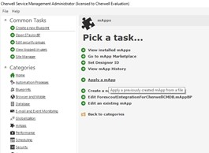

* Locate the .mAppz file.
* Follow the prompts of the wizard, accepting defaults and Attempt to publish the changes directly. (you’ll note the changes do not include a One Step, which is needed to get the configuration items into the destination class tables)

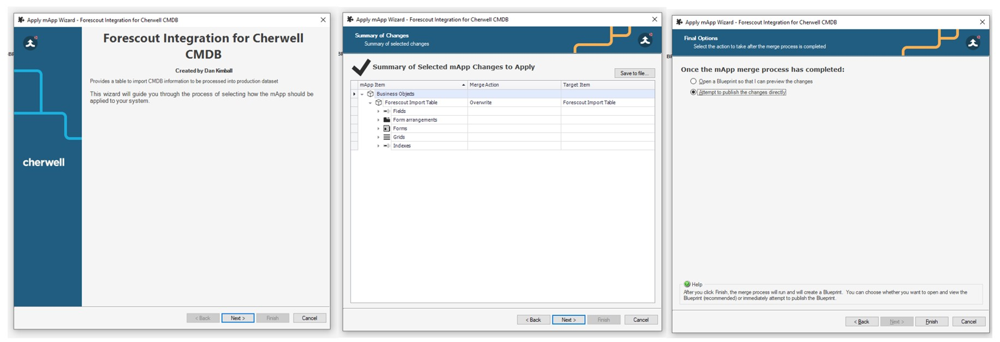

* Click on Security and Edit Users and create a new user and save.
* Click on Edit REST API Client settings, make note of the Client Key and the API URL.
* Back in the Forescout eyeSight Console, click Tools/Options/Connect, then on the Cherwell Application, click Add.
* Enter a name and the URL from the Cherwell Administrator application from Step 7. On the Cherwell Account Information “tab”, paste the API URL into the Client key field and enter the user credentials you created in Step 7.
* Now, launch the Cherwell Service Management application.
* One Step is how Cherwell will extract the records out of the Forescout Import Table, transform them as needed and create or update records in the CMDB Class Tables (see listing of tables below)

	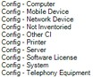

* After logging in, select One Step, then One Step Manager.

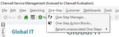

* Change the association to Forescout Import Table.

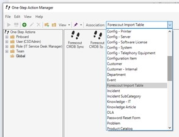

* Select + and give it a name. 

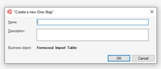

* Drag into the plus sign “Create a new Business Object”

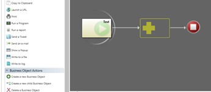

* Change the drop down to be the desired Config table.

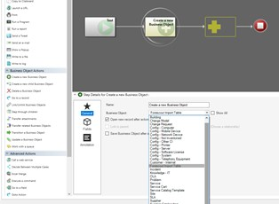

* Then click Fields and select each of the mandatory fields (with yellow ! triangle) and other fields you want to populate with data from Forescout.

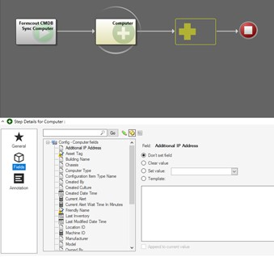

* If you want to select Template (pulling data from Forescout) vs a static entry, click the radio button for Template and then right click in the box and it’ll pull the available fields from Forescout. 

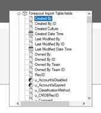

* After saving your One Step, you need to schedule it. Now open the Cherwell Administrator application and click Scheduling. Then Add.

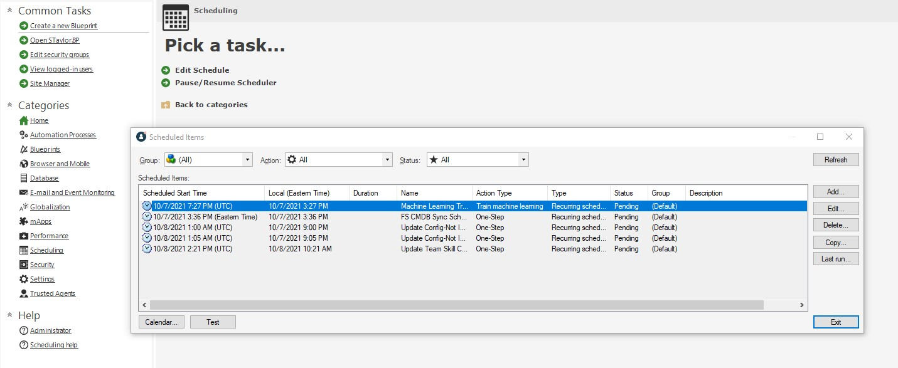

* Select One Step as the Action and then in the drop down, choose your specific One Step.

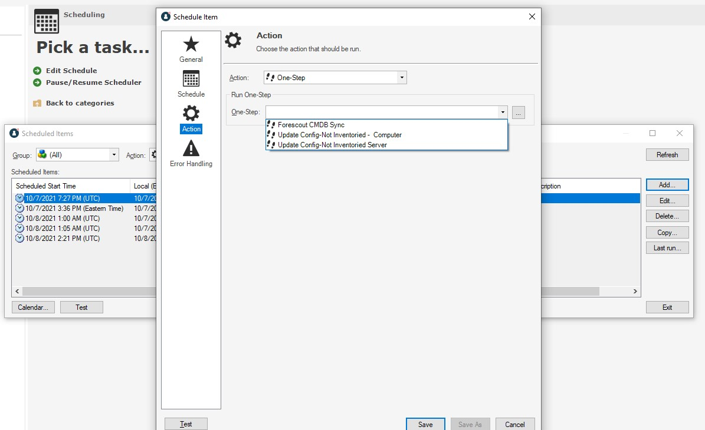

