Forescout eyeExtend Connect Aruba ClearPass APP README.md
 

## Contact Information

- Have feedback or questions? Write to us at

        **[connect-app-help@forescout.com](mailto:connect-app-help@forescout.com)**

## APP Support

- All eyeExtend Connect Apps posted here are community contributed and community supported. These Apps are not supported by the Forescout Customer Support team.
- See Contact Information above.

## About the Connect Aruba ClearPass APP

### Version v1.0.0 Aruba ClearPass APP

The APP gathers session data relating to <mark>RADIUS</mark> authentication(s), allowing you to build Forescout policies relating to the Aruba ClearPass

- ACTIONS (See section **Actions** for details)
  - ClearPass Change Profile.
	- ClearPass Update Forescout-ACTION Attribute.
  - ClearPass Update Endpoint Custom Attributes

<mark>Proxy mode is not supported in this version 1.0.0.
The next release will support proxy mode.</mark>

## Requirements

- Access to Aruba ClearPass 
- Forescout CounterACT 8.2, 8.1.4
- Forescout eyeExtend Connect 1.5 or higher
- See license.txt file for license information

## ClearPass Permissions

The APP requires a ClearPass API client.

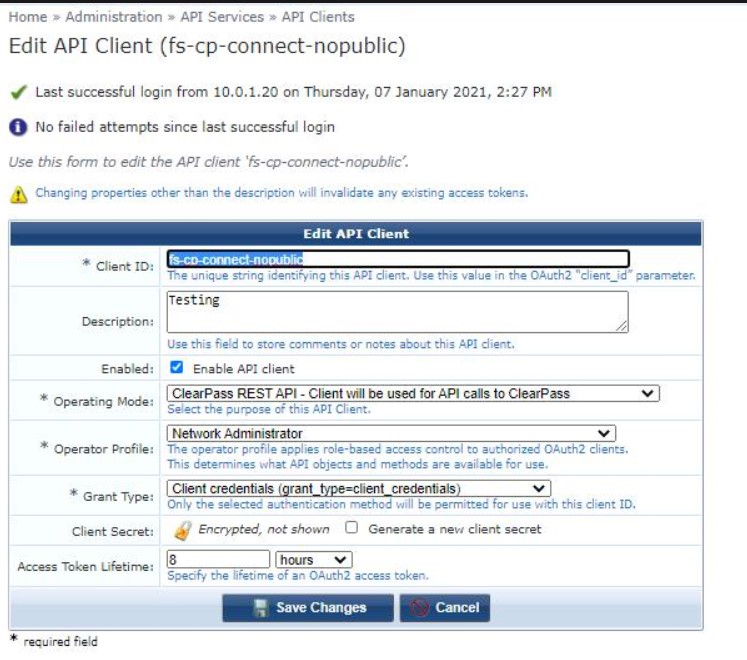

The APP actions have been tested with a the following permission to update endpoint attributes and change profiles.

Note the extra permission added in RED.

(Note: The profile was copied from the Network Administrator profile. The below images states Operator. Not sure why.)

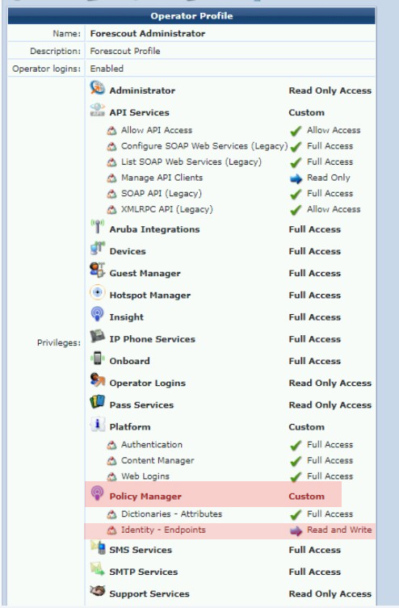

## User Interface

  You can refer to the Forescout eyeExtend Connect Module: Connect Application Building Guide, in particular the
  sections on ”Define system.conf File” and “User Interface Details”.

#### Predefined fields used panels

- Certification validation
- Authorization
- Rate limiter

##### Rate-limited API Count

- User can set rate-limiter for the API allowed to the Aruba ClearPass per second.
  - Default in the APP is allowing up to 100 API calls per second.
  - Range is 1 to 1000 APIs.

### Panels

#### Aruba ClearPass Connection

| Property| Comment|
| :------------------------------- | :-------------------------------- |
| Name       | Unique description used for ClearPass |
| Server Address | Example : ClearPass-Server.somedomain.com **No HTTPS prefix required** |
| Client ID | API Client ID |
| Client Secret | Aruba ClearPass Secret |
| Verify Client Secret |  |

### Aruba ClearPass Options

| Property                       | Comment|
|:------------------------------ |:-------------------------------------------------------------------------------------------------------------|
| Authorization Interval (Minutes) | Default **30** How often to do a full poll of Aruba ClearPass authentication token                                                                      |
| Poll Pagination Limit | Default **100** Example 1000 entries would require 10 queries to retrieve all the data. |
| Number of API queries per second | 100 See **Rate-limited API Count above** |
| Validate Server Certificate |  |

#### Focal appliance

Each "API Domain Gateway" shall run on one dedicated focal appliance.

### Test button

- Test is enabled by default.
- Device info need to be saved (applied) before test can be successfully run.

Example Test Result

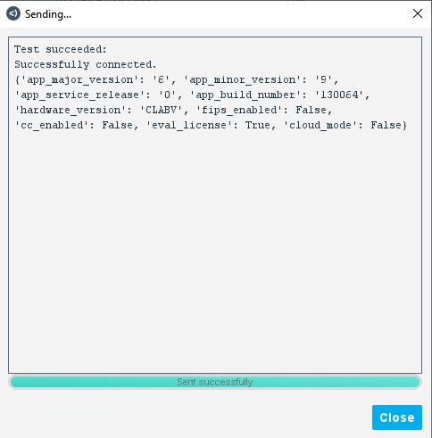

## Manage the APP

### Import

- User can import the Aruba ClearPass Connect APP via eyeExtend Connect module

- APP file shall look similar to **Forescout-arubacentral.eca** which is signed
  
  

## Start and Stop APP

- User can start and stop the Aruba ClearPass App

- When the APP is stopped, all properties resolve, actions and policy are suspended.
  
### Remove APP

- User can remove the APP if no longer needed

  - User need to delete the Aruba ClearPass policy(s) first to remove the App.

  

## Policy Templates

There are 2 default Aruba ClearPass Templates.

After importing the App. The policies can be found under Policy > Add > Aruba ClearPass > 

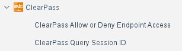

- ClearPass Query For Session ID

  Queries ClearPass for Session ID. Query using MAC address.

- ClearPass Allow or Deny Endpoint Access
ACTIONS DISABLED BY DEFAULT
Endpoints in Group : AllowAccess or DenyAccess
1. Tag the endpoint with DenyAccess or AllowAccess
	
	**Note**
	*Change to your Corporate TAG string*
	
2. Profile Change to Re-Authenticate the endpoint

    **Note**
    *Change to your Corporate Re-authenticate profile*
    Delay 5 seconds before sending action.

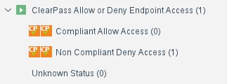

Two actions are required per sub rule.

1. Modify the endpoint attribute Forescout-ACTION
2. Send ClearPass change profile action, 5 seconds later.

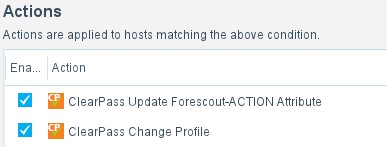

## Actions

- ClearPass Change Profile.
      Request ClearPass to change the endpoint profile. **(This requires connect_clearpass_id)**
- ClearPass Update Forescout-ACTION Attribute. **(Requires MAC Address)**
      This will create/update on the endpoint. Forescout-ACTION attribute

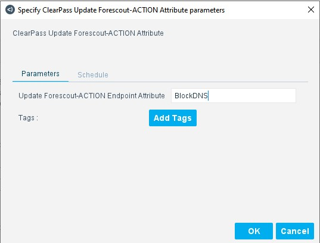

- ClearPass Update Endpoint Custom Attributes. **(Requires MAC Address)**
     This will allow for custom endpoint attribute(s) to be updated.

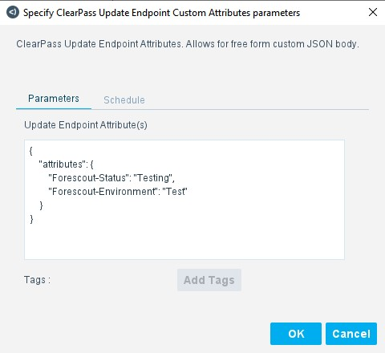

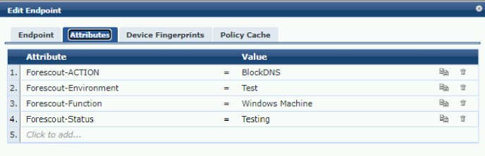

## Properties

## Properties gathered from the Aruba ClearPass.

  

- ClearPass Session ID

- ClearPass Username

- ClearPass NAS IP Address

- ClearPass ACCT Start Time

- ClearPass Calling Station ID

- ClearPass Called Station ID

- ClearPass CPPM UUID

- ClearPass NAS Port ID

- ClearPass NAS Port Type

- ClearPass NAS Name

- ClearPass ACCT Terminate Cause

- ClearPass Service Type

- ClearPass SSID

- ClearPass AP Name

- ClearPass MAC Address

- ClearPass Visitor Name

- ClearPass Visitor Company

- ClearPass Visitor Phone

- ClearPass Sponsor Name

- ClearPass Sponsor Email

- ClearPass Sponsor Profile Name

- ClearPass Role Name

## Scripts

* clearpass_authorization.py
* clearpass_resolve.py
* clearpass_test.py
* clearpass_attribute_custom_attributes.py
* clearpass_attribute_fs_action_attribute.py
* clearpass_reauth_profile.py
## Inventory

Asset Inventory properties

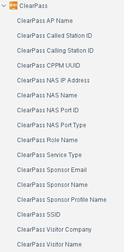

## ClearPass Notes

This is an example of a enforcement policy.

If endpoint attribute "Forescout-ACTION" equals "BlockDNS" take ClearPass action .....

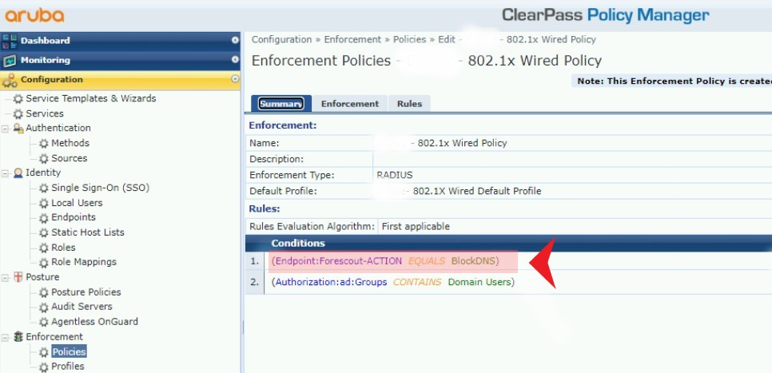