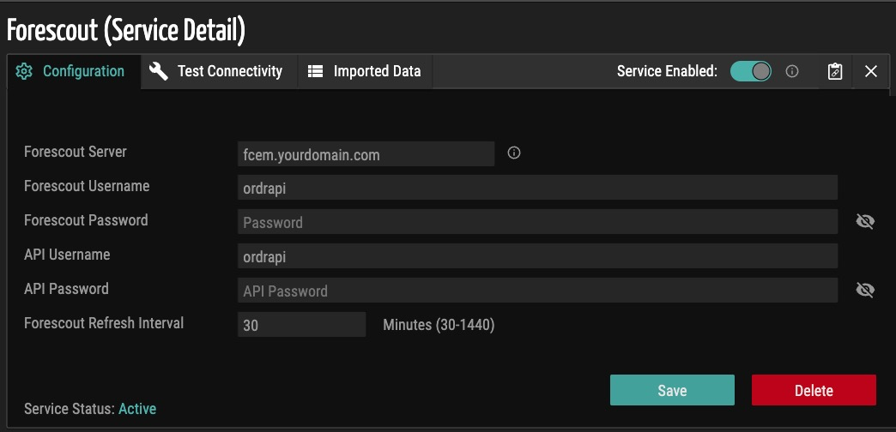
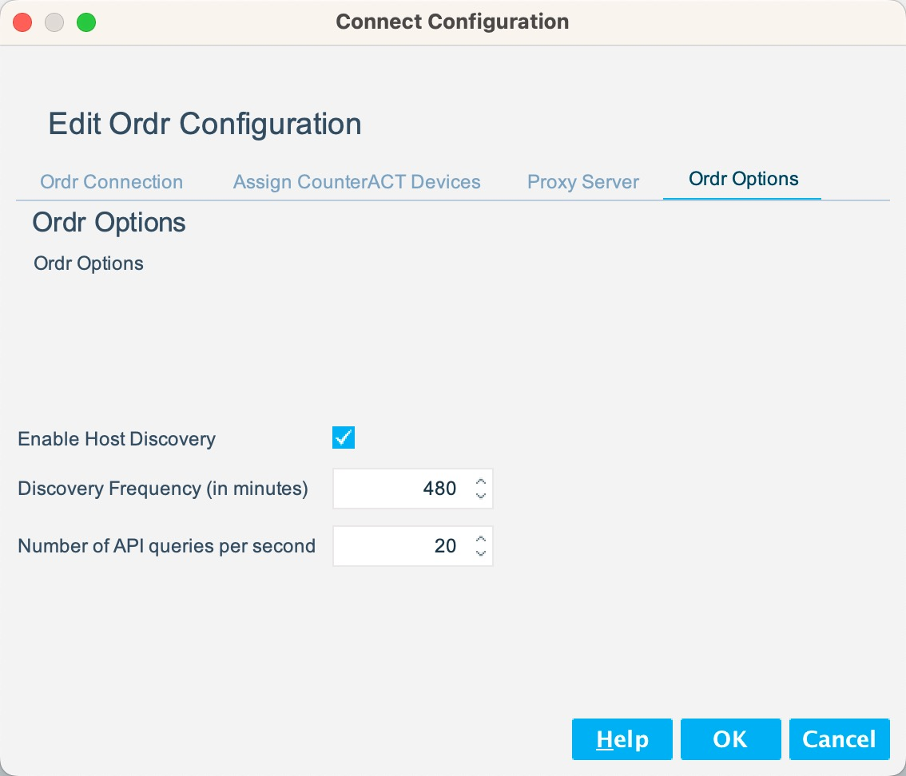
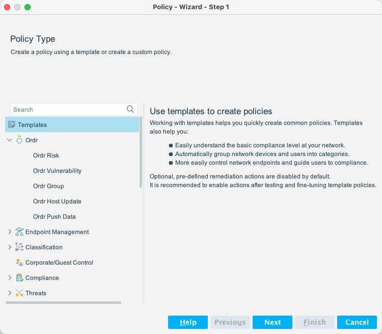
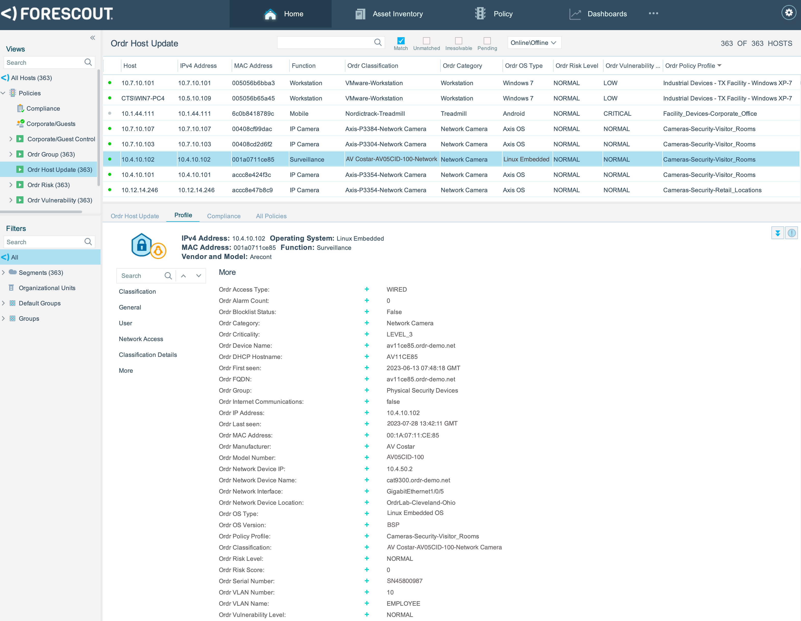

# Forescout eyeExtend Connect App for Ordr
Forescout eyeExtend Connect App for Ordr README.md

### Contact Information  

All eyeExtend Connect Apps posted here are community contributed and community supported. These Apps are not supported by the Forescout Customer Support team.

For questions of feedback, please send us an email below:

**[connect-app-help@forescout.com](mailto:connect-app-help@forescout.com)**

### Forescout Documentation Portal

To access Forescout documentation, please refer to [https://docs.forescout.com/](https://docs.forescout.com/)

## About the eyeExtend Connect App for Ordr

The Connect App for [Ordr](https://www.ordr.net) provides an interface for the eyeSight Platform to communicate with the Ordr Systems Control Engine (SCE).  

### Version 1.1.0
This version introduces support for the push of host data from Forescout to Ordr on host IP address changes. This feature allows more immediate update of Ordr device attributes including current MAC-to-IP binding data. A new Ordr Push Data policy template is included in this version to automate the push of updates from Forescout to Ordr.

### Version v1.0.0

The Ordr Connect App updates Forescout host properties with detailed device classification and context from Ordr. Ordr discovers every connected device including IIoT, IT, IoT, OT, managed and unmanaged hosts and provides Forescout rich context and security insights about each host. Users can build Forescout policies based on the Ordr Properties below:

### Properties

Property                      | Type       | Label                          | Description
----------------------------- | ---------- | -------------------------------| ---------------------------------
`connect_ordr_macAddress` | String     | Ordr MAC Address | Device MAC Address in Ordr
`connect_ordr_ipAddress` | String     | Ordr IP Address | Device IP Address in Ordr
`connect_ordr_devicename` | String     | Ordr Device Name | Device Name in Ordr
`connect_ordr_dhcpHostname` | String     | Ordr DHCP Hostname | Device DHCP Hostname in Ordr
`connect_ordr_fqdn` | String     | Ordr FQDN | Device FQDN in Ordr
`connect_ordr_group` | String     | Ordr Group | Device Classification Group in Ordr
`connect_ordr_profile` | String     | Ordr Classification | Device Classification Profile  in Ordr
`connect_ordr_category` | String     | Ordr Category | Device Classification Category in Ordr
`connect_ordr_policyProfile` | String     | Ordr Policy Profile | Device Policy Profile in Ordr
`connect_ordr_manufacturer` | String     | Ordr Manufacturer | Device Manufacturer in Ordr
`connect_ordr_modelNo` | String     | Ordr Model Number | Device Model Number in Ordr
`connect_ordr_serialNo` | String     | Ordr Serial Number | Device Serial Number in Ordr
`connect_ordr_osType` | String     | Ordr OS Type | Device OS Type in Ordr
`connect_ordr_osVersion` | String     | Ordr OS Version | Device OS Version in Ordr
`connect_ordr_firstSeen` | String     | Ordr First Seen | Device First Seen in Ordr
`connect_ordr_lastSeen` | String     | Ordr Last Seen | Device Last Seen in Ordr
`connect_ordr_accessType` | String     | Ordr Access Type | Device Access Type in Ordr
`connect_ordr_nwLocation` | String     | Ordr Network Device Location | Network Device Location in Ordr
`connect_ordr_nwDeviceName` | String     | Ordr Network Device Name | Network Device Name in Ordr
`connect_ordr_nwDeviceIp` | String     | Ordr Network Device IP | Network Device IP Address in Ordr
`connect_ordr_nwInterface` | String     | Ordr Network Interface | Network Device  Interface in Ordr
`connect_ordr_vlan` | String     | Ordr VLAN Number | Device VLAN Number in Ordr
`connect_ordr_vlanName` | String     | Ordr VLAN Name | Device VLAN Name in Ordr
`connect_ordr_riskScore` | String     | Ordr Risk Score | Device Risk Score in Ordr
`connect_ordr_riskLevel` | String     | Ordr Risk Level | Device Risk Level in Ordr
`connect_ordr_vulnLevel` | String     | Ordr Vulnerability Level | Device Vulnerability Level in Ordr
`connect_ordr_alarmCount` | String     | Ordr Alarm Count | Device Alarm Count in Ordr
`connect_ordr_deviceCriticality` | String     | Ordr Criticality | Device Criticality in Ordr
`connect_ordr_internetCommunication` | String     | Ordr Internet Communications | Device Internet Communications Status in Ordr

### Scripts

Script          | Function
--------------- | -----------------------------
ordr_test.py    | Test Script, will return device attributes from Ordr
ordr_resolve.py | Poll Script, collects device attributes from Ordr
ordr_push.py    | Push script, pushes device attributes to Ordr

## Requirements

- Ordr Systems Control Engine 8.2.0(R2)-FIPS, 9.0.1-FIPS, 9.0.1 or higher 
- Forescout CounterACT 8.3 or higher
- Forescout eyeExtend Connect Module 2.1 (Connect Plugin 2.0.0) or higher
- Forescout Policy based on Ordr host attribute(s)
- Review [license.txt](Ordr-1.1.0/license.txt) file for license information

## Ordr SCE Configuration

The Ordr Connect App requires API access to Ordr SCE. Additionally, Ordr can fetch data from Forescout using the Web API.

- From the Ordr SCE <b>Integrations</b> page, select Forescout
- Under the <b>Configuration</b> tab, configure the Forescout Server, Web API credentials, Ordr API credentials, and click Save.

   

Below are descriptions for each field:

Field                            | Description
-------------------------------- | -------------------------------------------------
Forescout Server                 | Forescout Enterprise Manager IP address or FQDN
Forescout Username               | Forescout Web API Username
Forescout Password               | Forescout Web API Password
API Username                     | Ordr SCE API Username
API Password                     | Ordr SCE API Password
Forescout Refresh Interval       | Polling Interval (in minutes) for Web API queries

<b>Note: If Push Data policy is enabled, device info is sent to Ordr on every host IP address change. It is therefore recommended to set a longer refresh interval, for example 1440 minutes (24 hours), to minimize the number of API requests Ordr sends to the Forescout Server for device updates.</b>

## Installing the Connect App for Ordr

Verify the Forescout eyeExtend Connect module is installed and running under **Tools** > **Options** > **Modules**.

Next, import the Connect App for Ordr and add a system description.

### Import the Ordr App

1. Go to **Tools** > **Options** > **Connect**.
2. In the App Configuration tab of the **Connect** pane, click **Import**.
3. Apps that can be imported are in .zip or .eca format. Select the Ordr App file and click **Import**.
4. Select **Close** when the import has finished. A blank **System Description** dialog box opens. 

### Add a System Description
To configure the Ordr App, you add a system description to define the connection to Ordr SCE. To add the system description:

1. Once the Ordr App is imported, the **System Description** dialog box opens. It is initially blank and only the **Add** and **Import** buttons are enabled.
2. Click **Add**.
3. Configure the Ordr App. 

## Configuring the Connect App for Ordr

There are two system panels provided with the App that must be configured.

### Ordr Connection Panel

   

Below are descriptions for each field:

Field                            | Description
-------------------------------- | ------------------------------------------
URL                              | The URL of Ordr SCE
User Name                        | The SCE API Username configured in Ordr  [Refer to Ordr SCE Configuration section]
Password                         | The SCE API Pssword configured in Ordr  [Refer to Ordr SCE Configuration section]
Push Data                        | Check to enable Forescout to push updates to Ordr SCE
Validate Server Certificate      | If checked, eyeSight will validate the Ordr certificate

### Ordr Options Panel

   

Below are descriptions for each field:

Field                            | Description
-------------------------------- | ------------------------------------------
Enable Host Discovery            | Must be checked to collect and update Ordr attributes per Discovery Frequency
Discovery Frequency (in minutes)    | How often to poll Ordr SCE for device updates (default = 480)
Number of API queries per second    | API query rate (default = 20)

Click <b>OK</b> to save the system description. The system description is displayed in the App Configuration tab of the Connect pane. Next, click <b>Apply</b> to save the Connect module configuration.

### Test button

- Test is enabled by default.
- Device info need to be saved (applied) before test can be successfully run.

Example Test Result

### Refreshing Discovery of Hosts and Ordr Attributes

Use the refresh button to manually poll Ordr for device updates.

## Manage the Ordr Connect App

### Import the Ordr Connect App

- User can import the Ordr Connect App via the eyeExtend Connect module

  See <a href="#import-the-ordr-app">Import the Ordr App</a> for additional details.

### Start and Stop the Ordr Connect App

- User can start and stop the Ordr Connect App

- When the App is stopped, all attribute updates are suspended.

### Remove the Ordr Connect App

- User can remove the Ordr Connect App

- User must first delete any policies based on Ordr attributes before app can be removed.   

## Policy Templates

There are five default Ordr Policy Templates that enable continuous update of host information learned by Ordr. After importing the Ordr Connect App, these policies can be found under Policy > Add > Ordr. Additional custom policies can be created to enforce segmentation or take other actions based on Ordr host attributes.

- Ordr Host Update

  Query Ordr for updates to host attributes. 
  
- Ordr Group

  Query Ordr for device classification groups.

- Ordr Risk

  Query Ordr for device risk level.

- Ordr Vulnerability

  Query Ordr for device vulnerability level.  
  
- Ordr Push Data

  Push host attribute updates to Ordr.   

<b>Note: One policy is required to regularly update Forescout hosts with current Ordr attributes. Additionally, to push Forescout host attributes to Ordr when a host changes its IP address, it is recommended to include the Ordr Push Data policy.</b>

Optionally, a custom policy can be configured to trigger periodic host updates from Ordr as shown in the following example.

### Sample Host Update Policy
To trigger data collection from Ordr SCE, at least one policy must be configured and enabled using an Ordr device attribute as a condition. Under Policy Manager, Add a custom policy to match on any value of the Ordr Category or Ordr Group attribute; no actions are required for host updates only.

  
### Sample Host Properties View of Ordr Attributes

## Configure the Web API

The Web API enables Ordr to periodically retrieve host data from Forescout independently of the Push Data option in the Connect App. While the Web API is not required by the Ordr Healthcare Connect App, it is included here for reference to complete the Ordr integration with Forescout. 

   

1. Go to **Tools** > **Options** > **Web API**.
2. In the User Settings tab of the **Web API** pane, click **Add**.
3. The **Credentials** dialog box opens. Enter the credentials for the Web API and click **OK**.
4. Click **Apply** to save changes.

### Web API Access Restrictions

Configure source IP addresses allowed to access the Web API

   

1. In the Client IPs tab of the **Web API** pane, click **Add**.
2. The **Add IP Range** dialog box opens. Enter the IP Range from which to allow Web API requests. To restrict access only to Ordr, enter the management IP address of the Ordr Integration node, for example x.x.x.x/32. To allow access from any IP, select the **All IPv4** option. 
3. Click **OK** to close the dialog box and verify the list of allowed Client IPs is correct. 
4. Click **Apply** to save changes.

## Future Enhancements

If you have suggestions for future enhancements or would like to contribute, please let us know on the [Forescout Community Slack](https://forescout.slack.com/).
