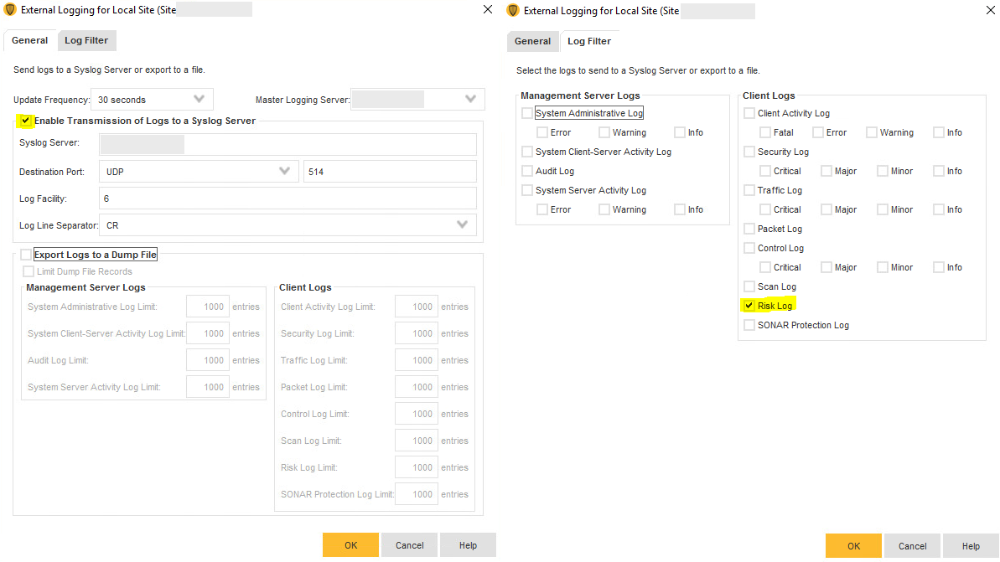

Forescout eyeExtend Connect Symantec App README.md
Version: 1.0.0

## Contact Information

Have feedback or questions? Write to us at
**[connect-app-help@forescout.com](mailto:connect-app-help@forescout.com)**

## About the Documentation
 Refer to the Technical Documentation page on the Forescout website for additional documentation:
https://docs.forescout.com/

## About the eyeExtend Connect Symantec App
The Connect Symantec App leverages Symantec Endpoint Protection Manager (SEPM) to collect information about the endpoints such as operating system, logged on user, whether the endpoint has anti-virus installed, etc.
- Control individual Symantec Endpoint Protection components on all supported operating systems.
- Check and report endpoints based on Symantec compliance.
- Ensure endpoints are enrolled with Symantec Endpoint Protection Manager.
- Trigger a full System Symantec Endpoint Protection antivirus scan based on threats reported from other malware detection or Advanced Threat Detection (ATD) products that may be installed in your environment.

## Requirements
The App supports:
- Symantec Endpoint Protection Manager 14 and up 
- Forescout CounterACT 8.2.2
- Forescout eyeExtend Connect 1.6.0
- See license.txt file for license information

## User Interface
You can refer to the Forescout eyeExtend Connect Module: Connect Application Building Guide, in particular the
sections on ”Define system.conf File” and “User Interface Details”.

### Configuration
#### Server Connection
User can add SEPM server to the App.
- Server Address: IP address or the host name of the SEPM server. Do not include the protocol (http://, https://, etc.)
- Server Port: the web service port number on which the Remote Management and Monitoring (RMM) service of SEPM listens. Default port is 8446.
- Admin Username: Admin username to authenticate to SEPM.
- Admin Password: Admin password to authenticate to SEPM.
- Domain: SEPM domain name (optional).
- Validate server certificate: Checkbox to use the imported certificate in Licences.
- Authorization refresh interval (in minutes): Refresh interval for authentication token. Symantec access token is expired in 43199 seconds (~720 mins). By default, the app sets authorization refresh interval as 600 minutes. 
- User can test the device by clicking the TEST button after applying changes.

#### Focal Appliance
Each device shall run on one dedicated focal appliance.

#### Proxy Server
- User can connect to the SEPM server via proxy server.
- Fields
    - Proxy Server
    - Proxy Server Port
    - Proxy Server Username
    - Proxy Server Password
- Proxy server username and password are not required and may be left blank for proxy servers that don't require authentication.

#### Syslog Source
Define a Syslog source to send syslog message to Forescout.
- Use Syslog Source: check the box to define a Syslog source.
- Syslog Source Name or IP: Hostname or IP address of the server where the Syslog message comes from.

#### Rate-limited API Count
- User can set rate-limiter for the API calls allowed to SEPM server per unit time.
- Default in the App allows up to 100 API calls per second.
- Range is 1 to 1000 APIs.

#### Predefined fields used panels
- Certification validation
- Authorization
- Rate limiter

#### Symantec Options
- Poll Page Size: the maximum number of endpoints to poll within a page. Default is 50.
For example: There are total 85 endpoints detected by SEPM, assume that no other filters applied (range, etc...), the first 50 endpoints will be loaded in the 1st page, and the remaining 35 endpoints will be loaded in 2nd page.
- Poll Page Range: the range of the page you want to load (starting from 1).
The range should be in format <start_number><dash><end_number>. Whitespaces are acceptable.
Examples of valid ranges: 2-5, 2--5, 2 -  5. This means you want to poll only from the 2nd page to the 5th page.
- Poll Page Size and Poll Page Range are used to control the number of endpoints to poll for each connecting device to prevent polling script running long when there are a large number of endpoints.
For example: Assume that there are 120 endpoints and you want each CounterACT device to poll only 45 endpoints max.
The configuration should be:
    - Set Poll Page Size as 45.
    - You will needs 3 CounterACT devices to poll all the endpoints and Poll Page Range setting for the devices are 1-1 (polling the first 45 endpoints), 2-2 (polling the second 45 endpoints), 3-3 (polling the remaining 30 endpoints)
    
### Test button
- Test is enabled by default.
- Device info needs to be saved (applied) before test can be successfully run.

## Manage the App
### Import
- User can import the Symantec Connect App via the eyeExtend Connect module.
- App file shall look like ForeScout-symantec-1.0.0.eca which is signed.

### Start and Stop App
- User can start and stop the Symantec App.
- When the App is stopped, all polling, properties resolve, actions and policies are suspended.

### Remove App
- User can remove the App if no longer needed.
- User needs to delete the Symantec policies first to remove the App.

## Policy Templates
- After importing the App, the policies can be found under Policy > Add > Symantec
- The following default templates are available for detecting and managing endpoints :
  - Symantec Anti-Virus Compliance template - Detects which endpoints have the Symantec Agent installed and running with Auto-Protect enabled.
  - Symantec Host Integrity Compliance template - Based on compliance information, the CounterACT operator will send email to notify the admin about non-compliant endpoints.
  - Symantec Host Infected template - Detects whether an endpoint is infected or not. If infected, the Host Infected policy instructs what actions to take.
  - Symantec Intrusion Protection Compliance template - Converts the Intrusion Prevention System configurations from Symantec into compliance information in CounterACT.
  - Symantec Network Threat Protection Compliance template - Offers the ability to enable Network Threat Protection on endpoints where it's not enabled.
  - Symantec Online Network for Advanced Response Compliance template - When an endpoint is not compliant due to the status of the SONAR component, Symantec reports it to CounterACT.
  - Scan on IOC Alert template - This policy waits for reports of IOCs/malware from other integrated engines via the Advanced Threat Detection (ATD) integrations of CounterACT. When ATD integrations within CounterACT detect a threat, that threat is ingested and triggers a scan on Symantec-managed endpoints.
- User can create Custom Symantec Policies that use properties provided by Symantec Connect App, and other CounterACT properties and actions, to deal with issues not covered in the default policy templates.

## Properties
- There are 15 properties gathered from the SEPM server for an endpoint.

 | Properties | Description |
 | ------- | ------- |
 | Symantec Computer ID | Indicates the computer ID of the endpoint. |
 | Symantec Computer Name | Indicates the computer name of the endpoint. |
 | Symantec Mac Address | Indicates MAC address of the endpoint. |
 | Symantec IP Address | Indicates IPv4 address of the endpoint. |
 | Symantec Operating System | Indicates Operating System of the endpoint. |
 | Symantec Anti-Virus Definition Date | Indicates the date the Anti-Virus was last updated on the endpoint. |
 | Symantec Auto-Protection Status Change | Indicates whether there's been a change to the Auto-Protection status. |
 | Symantec Host Infected | Indicates whether an endpoint is infected. |
 | Symantec Host Integrity Status | Indicates the Symantec integrity status detected on the endpoint. |
 | Symantec Host Managed | Indicates whether the endpoint is managed by a SEPM. |
 | Symantec IPS Status | Indicates the status of the Intrusion Prevention System (IPS) on the endpoint. |
 | Symantec Last Synchronization Time | Indicates the last time the Symantec Agent communicated with the SEPM. |
 | Symantec Threat Protection Enabled | Indicates whether the Symantec Network Threat Protection is enabled. |
 | Symantec SONAR Status | Indicates the status of the Symantec Online Network for Advanced Response (SONAR). |
 | Symantec Host Infected Information | Indicates information about the infection(s) detected on the endpoint by Symantec. |
 
- The first five properties (Symantec Computer ID, Symantec Computer Name, Symantec Mac Address, Symantec IP Address and Symantec Operating System) are updated during endpoint polling/discovery. 
- The last property (Symantec Host Infected Information) is updated when a threat is reported through Syslog message. |
- The other properties are policy properties and can be manually resolved by policy recheck.

## Actions
- User can send a command from SEPM to Symantec Endpoint Protection clients to request an active scan or a full scan on an endpoint.        
- User can send a command from SEPM to Symantec Endpoint Protection endpoints to update content of an endpoint.

## Scripts
There are seven scripts: 
- symantec_authorization.py
    - User can get authenticated and obtain an access token to SEPM server. The authentication token can be refreshed in a specified period defined by the user. Default is 10 hours.
- symantec_poll.py
    - User can enable discovery on a specified period to poll endpoint properties. Default is 4 hours.
- symantec_resolve.py
    - User can get the SEPM properties of an endpoint.
- symantec_test.py
    - User can test the connection to SEPM server.
- symantec_parse_syslog_message.py
    - User can set up Syslog server to receive the threat information from SEPM server, process the threat related message from Syslog and send it to IOC Scanner. 
    - Note that, the user must enable risk log and export data to the Syslog server to get the information about risk events on SEPM server and the managed endpoints.  
- symantec_scan_endpoint.py
    - User can send a command from SEPM to Symantec Endpoint Protection clients to request an active scan or a full scan on the client computer.    
- symantec_update_endpoint.py
    - User can send a command from SEPM to Symantec Endpoint Protection endpoints to update content.

## Parsing IOC information from Syslog
- This is a new Syslog feature of Connect 1.6.0 to parse threat information reported from Symantec Endpoint Protection Server (SEPM) to Forescout through Syslog message.
- Syslog module must be running and Syslog source must be set during configuration to receive the threat-related message from SEPM server.
- Once a threat message comes in, Symantec Connect App uses symantec_parse_syslog_message.py script to retrieve the message, extract the threat information from the message (such as threat name, hash, hash type, severity, filename, filesize, etc...) into a proper format. Then sends the information to IOC Scanner to store it.
- Below is a sample Syslog message when there is a risk detected.
    - *<54>Jun 22 00:36:45 TEST-SEP14 SymantecServer: Virus found,IP Address: x.x.x.x,Computer name: TEST-W2k12R2,Intensive Protection Level: 0,Certificate issuer: ,Certificate signer: ,Certificate thumbprint: ,Signing timestamp: 0,Certificate serial number: ,Source: Auto-Protect scan,Risk name: Trojan.Gen.NPE.2,Occurrences: 1,C:\Users\TEST\Downloads\eicarcom2.zip,,Actual action: Left alone,Requested action: Left alone,Secondary action: Left alone,Event time: 2021-06-22 00:21:36,Inserted: 2021-06-22 00:36:45,End: 2021-06-22 00:21:37,Last update time: 2021-06-22 00:36:45,Domain: Default,Group: My Company\Default Group,Server: QALAB-SEP14,User: Administrator,Source computer: ,Source IP: ,Disposition: Bad,Download site: ,Web domain: ,Downloaded by: chrome.exe,Prevalence: This file has been seen by tens of thousands of Symantec users.,Confidence: This file is untrustworthy.,URL Tracking Status: Off,,First Seen: Symantec has known about this file for more than 1 year.,Sensitivity: ,Not on the permitted application list,Application hash: E1105070BA828007508566E28A2B8D4C65D192E9EAF3B7868382B7CAE747B397,Hash type: SHA2,Company name: ,Application name: eicarcom2.zip,Application version: ,Application type: 127,File size (bytes): 308,Category set: Malware,Category type: Virus,Location: Default*
- The parsing script is based on the current format of Syslog message for risk log. If there is a format change in the future, the script should be modified/updated.
### Export risk log to a Syslog server
- Symantec App extracts IOC information from a Syslog message containing Risk log data.
- The Risk log includes information about risk events on SEPM and their clients/endpoints. It can be exported to a Syslog server as following.  
  

- For more information, refer to [Exporting data to a Syslog server](https://techdocs.broadcom.com/us/en/symantec-security-software/endpoint-security-and-management/endpoint-protection/all/Monitoring-Reporting-and-Enforcing-Compliance/viewing-logs-v7522439-d37e464/exporting-data-to-a-syslog-server-v8442743-d15e1107.html)  

## Licenses
This App bundles with a license.txt file. Please review the license.txt file.