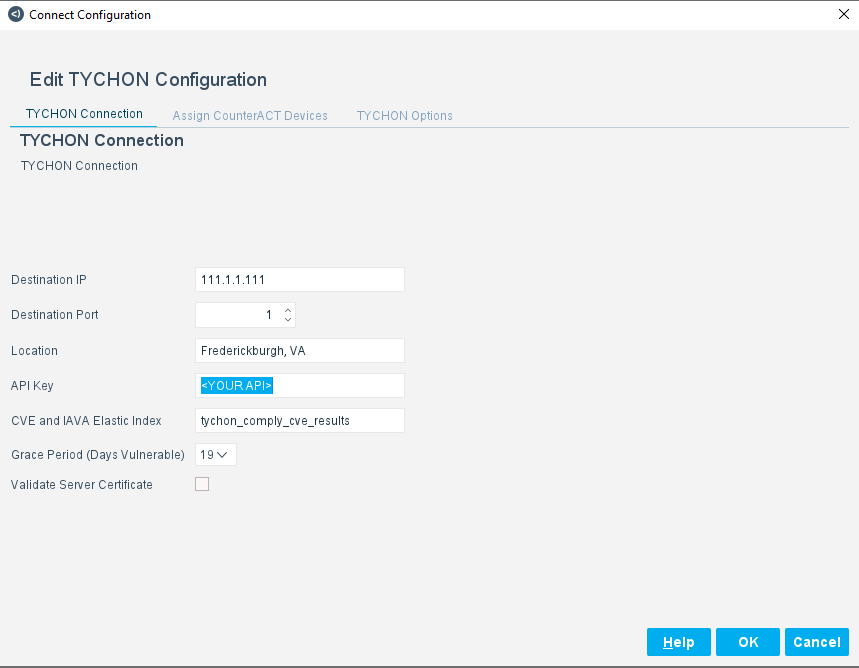
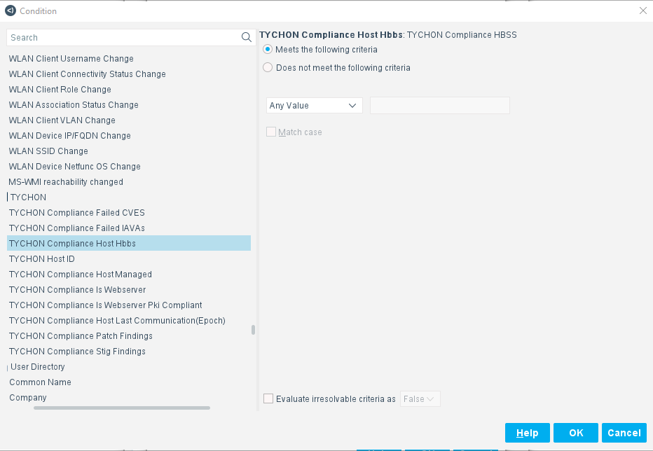
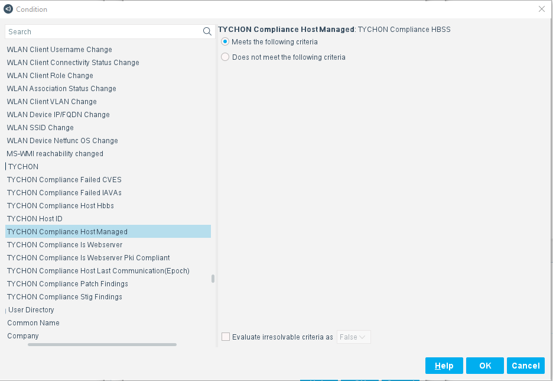
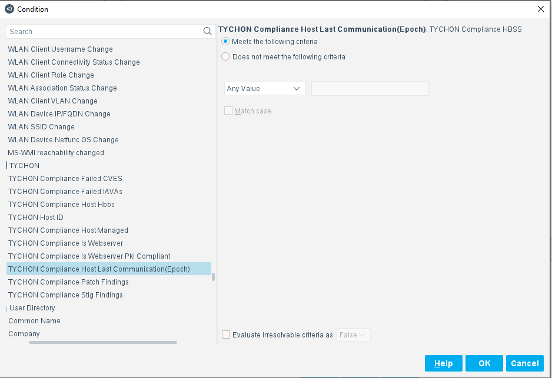
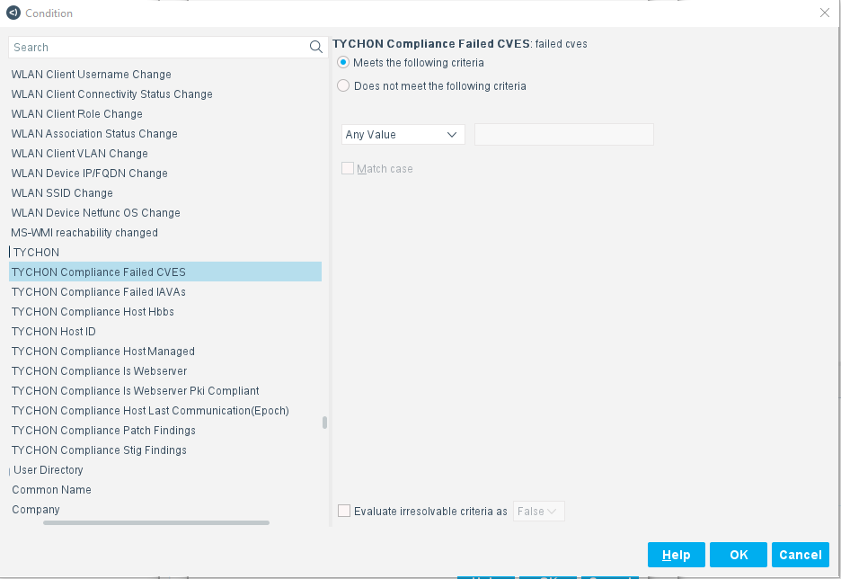
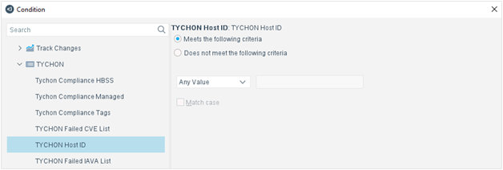
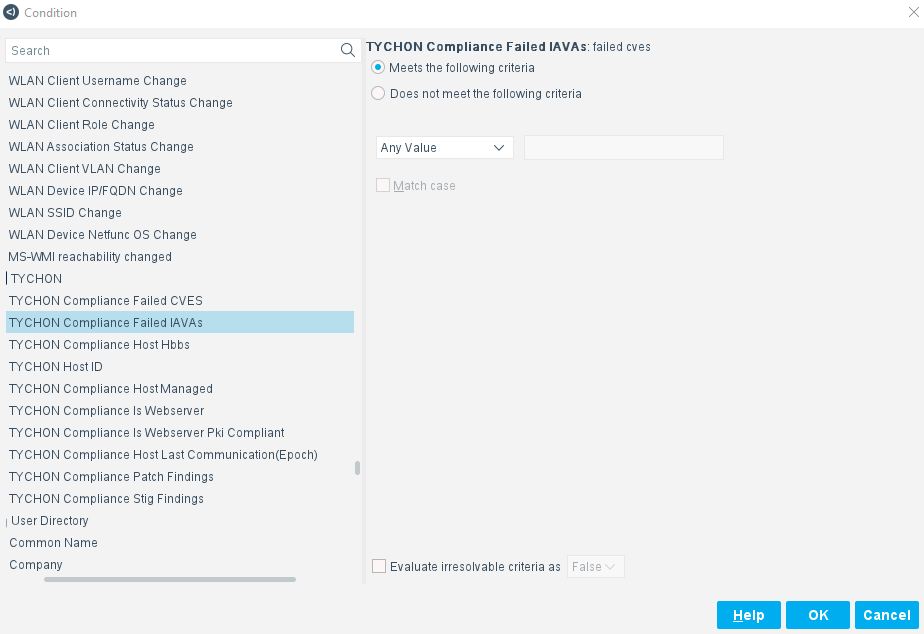
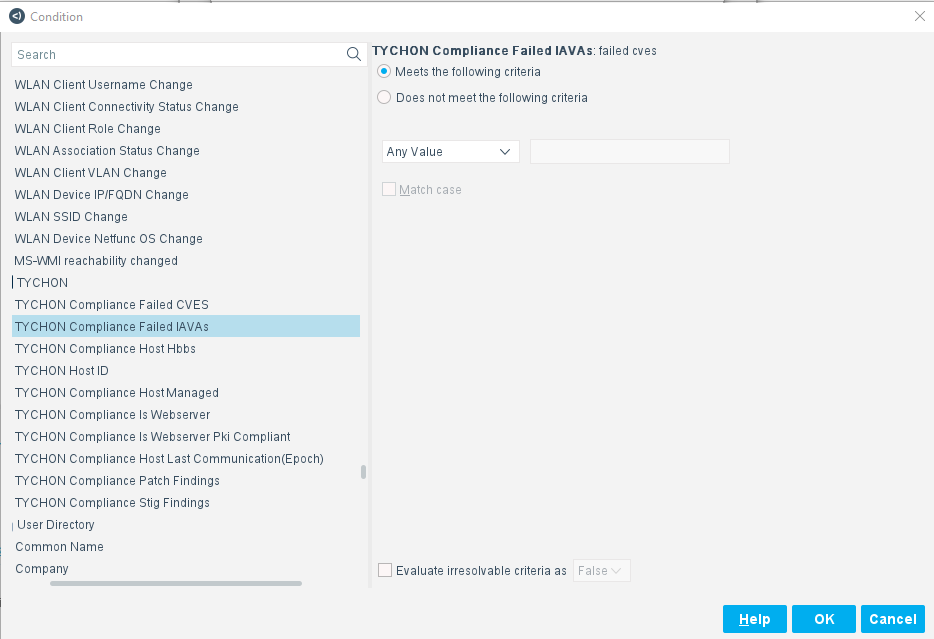
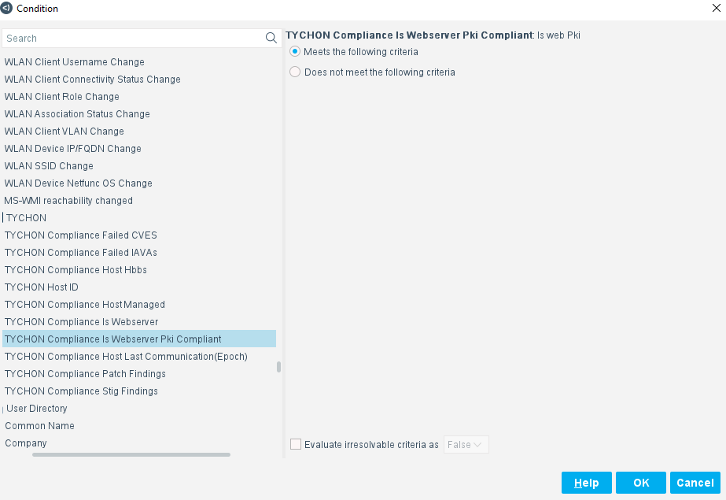
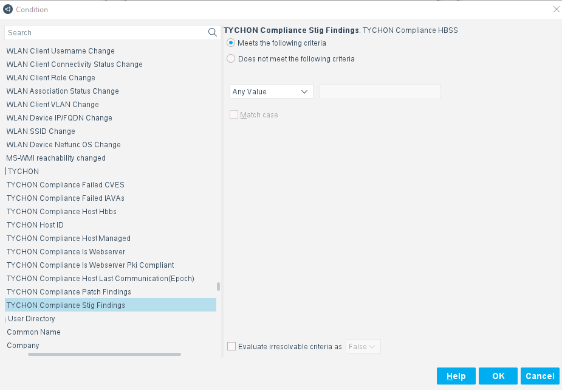

TYCHON Connect App README

**Contact Information**

Tychon LLC, 725 Jackson Street, Suite 101 Fredericksburg, VA 22401

Email: [INFO@TYCHON.IO](mailto:info@tychon.io)

Support: [(540) 699-3817](tel:540-699-3817)

**About the App**

The TYCHON Connect App for Forescout provides critical endpoint data
used by CounterACT policy to determine network eligibility. TYCHON
endpoint data includes Endpoint Point Products, Security Software
compliance information, failed Common Vulnerabilities and Exposures
(CVEs), and failed IAVAs. CounterACT evaluates TYCHON Connect data
against existing policy and, if an endpoint is determined to be in
violation of an organization's policy, can automatically respond.  

**1.0.16 Release**

This version adds support for

-   TYCHON Compliance Host HBSS

-   TYCHON Compliance Host Managed

-   TYCHON Compliance Host Last Communications(Epoch)

-   TYCHON Compliance Failed CVE List

-   TYCHON Compliance Failed IAVA List

-   TYCHON Compliance is Webserver

-   TYCHON Compliance is Webserver PKI

-   TYCHON Compliance Stig Finding

-   TYCHON Compliance Patch Findings

-   TYCHON Host ID

This version is compatible with

-   TYCHON 1.7.6.7

**Requirements**

This App supports

-   Forescout CounterACT 8.2

-   See license.txt file for license information

**User Interface**

**Panels**

-   TYCHON Connection

-   TYCHON Compliance HBSS

-   TYCHON Compliance Managed

-   TYCHON Compliance Tags

-   TYCHON Failed CVE List

-   TYCHON Host ID

-   TYCHON Failed IAVA List

**TYCHON Connection**

{width="5.0in" height="3.8854166666666665in"}

+--------------------------+-------------------------------------------+
| **Property**             | **Description**                           |
+==========================+===========================================+
| Destination IP           | Example**: 10.1.8.102**                   |
|                          |                                           |
|                          | TYCHON DMN WSAPI IP                       |
+--------------------------+-------------------------------------------+
| Destination Port         | Example: **8443**                         |
|                          |                                           |
|                          | Port used for WSAPI communication.        |
+--------------------------+-------------------------------------------+
| Location                 | Example: Fredericksburg, VA               |
|                          |                                           |
|                          | Physical Location of Forescout Host       |
|                          | Appliance                                 |
+--------------------------+-------------------------------------------+
| API Key                  | API Key used to call APIs for WSAPI       |
+--------------------------+-------------------------------------------+
| CVE and IAVA Elastic     | Example: **tychon_cve_results**           |
| Index                    |                                           |
|                          | TYCHON Index where the CVE and IAVA data  |
|                          | resides.                                  |
+--------------------------+-------------------------------------------+
| Grace Period (Days       | Example: **21**                           |
| Vulnerable)              |                                           |
|                          | The number of days after a known CVE or   |
|                          | IAVA failure is detected before it is     |
|                          | reported.                                 |
+--------------------------+-------------------------------------------+
| Validate Server          | Select to instruct the driver to validate |
| Certificate              | the certificate sent by the TYCHON DMN    |
|                          | WSAPI Server.                             |
+--------------------------+-------------------------------------------+

**TYCHON Compliance Host HBSS**

{width="5.0in" height="3.4583333333333335in"}

+--------------------------+-------------------------------------------+
| **Property**             | **Description**                           |
+==========================+===========================================+
| Meets the following      | Select the appropriate radio button to    |
| criteria                 | determine if the system returns a true or |
|                          | false value.                              |
| Does not meet the        |                                           |
| following criteria       |                                           |
+--------------------------+-------------------------------------------+
| Value Type               | Example: **Contains**                     |
|                          |                                           |
|                          | Select the appropriate data qualifier.    |
+--------------------------+-------------------------------------------+
| Value(s)                 | Example: **HIPS1.4.7**                    |
|                          |                                           |
|                          | Enter the appropriate HBSS Name and       |
|                          | Version details.                          |
+--------------------------+-------------------------------------------+

**TYCHON Compliance Host Managed**

{width="5.0in" height="3.4375in"}

+--------------------------+-------------------------------------------+
| **Property**             | **Description**                           |
+==========================+===========================================+
| Meets the following      | Select the appropriate radio button to    |
| criteria                 | include or exclude assets that are        |
|                          | managed by TYCHON and ePO.                |
| Does not meet the        |                                           |
| following criteria       |                                           |
+--------------------------+-------------------------------------------+

**TYCHON Compliance Host Last Communications(Epoch)**

{width="5.0in" height="3.4270833333333335in"}

+--------------------------+-------------------------------------------+
| **Property**             | **Description**                           |
+==========================+===========================================+
| Meets the following      | Select the appropriate radio button to    |
| criteria                 | determine if the system returns a true or |
|                          | false value.                              |
| Does not meet the        |                                           |
| following criteria       |                                           |
+--------------------------+-------------------------------------------+
| Value Type               | Example: **Contains**                     |
|                          |                                           |
|                          | Select the appropriate data qualifier.    |
+--------------------------+-------------------------------------------+
| Value(s)                 | Example: **1649708605**                   |
|                          |                                           |
|                          | Enter the appropriate Epoch Time.         |
+--------------------------+-------------------------------------------+

**TYCHON Compliance Failed CVE List**

{width="5.0in" height="3.4375in"}

+--------------------------+-------------------------------------------+
| **Property**             | **Description**                           |
+==========================+===========================================+
| Meets the following      | Select the appropriate radio button to    |
| criteria                 | determine if the system returns a true or |
|                          | false value.                              |
| Does not meet the        |                                           |
| following criteria       |                                           |
+--------------------------+-------------------------------------------+
| Value Type               | Example: **Contains**                     |
|                          |                                           |
|                          | Select the appropriate data qualifier.    |
+--------------------------+-------------------------------------------+
| Value(s)                 | Example: **CVE-1999-123456**              |
|                          |                                           |
|                          | Enter the appropriate CVE identifier.     |
+--------------------------+-------------------------------------------+

**TYCHON Host ID**

{width="5.0in" height="1.6875in"}

+--------------------------+-------------------------------------------+
| **Property**             | **Description**                           |
+==========================+===========================================+
| Meets the following      | Select the appropriate radio button to    |
| criteria                 | determine if the system returns a true or |
|                          | false value.                              |
| Does not meet the        |                                           |
| following criteria       |                                           |
+--------------------------+-------------------------------------------+
| Value Type               | Example: **Contains**                     |
|                          |                                           |
|                          | Select the appropriate data qualifier.    |
+--------------------------+-------------------------------------------+
| Value(s)                 | Example**: \<GUID\>\_\<GUID\>**           |
|                          |                                           |
|                          | Enter the appropriate Host ID details.    |
+--------------------------+-------------------------------------------+

**TYCHON Compliance Failed IAVA List**

{width="5.0in" height="3.4270833333333335in"}

+--------------------------+-------------------------------------------+
| **Property**             | **Description**                           |
+==========================+===========================================+
| Meets the following      | Select the appropriate radio button to    |
| criteria                 | determine if the system returns a true or |
|                          | false value.                              |
| Does not meet the        |                                           |
| following criteria       |                                           |
+--------------------------+-------------------------------------------+
| Value Type               | Example: **Contains**                     |
|                          |                                           |
|                          | Select the appropriate data qualifier.    |
+--------------------------+-------------------------------------------+
| Value(s)                 | Example: **IAVA-2020-A-0123**             |
|                          |                                           |
|                          | Enter the appropriate IAVA identifier.    |
+--------------------------+-------------------------------------------+

**TYCHON Compliance Is Webserver**

{width="5.0in" height="3.4166666666666665in"}

+--------------------------+-------------------------------------------+
| **Property**             | **Description**                           |
+==========================+===========================================+
| Meets the following      | Select the appropriate radio button to    |
| criteria                 | determine if the system returns a true or |
|                          | false value.                              |
| Does not meet the        |                                           |
| following criteria       |                                           |
+--------------------------+-------------------------------------------+
| Value Type               | Example: Matches                          |
|                          |                                           |
|                          | Select the appropriate data qualifier.    |
+--------------------------+-------------------------------------------+
| Value(s)                 | Example: **True**                         |
|                          |                                           |
|                          | Return Boolean                            |
+--------------------------+-------------------------------------------+

**TYCHON Compliance Is Webserver PKI**

{width="5.0in" height="3.4375in"}

+--------------------------+-------------------------------------------+
| **Property**             | **Description**                           |
+==========================+===========================================+
| Meets the following      | Select the appropriate radio button to    |
| criteria                 | determine if the system returns a true or |
|                          | false value.                              |
| Does not meet the        |                                           |
| following criteria       |                                           |
+--------------------------+-------------------------------------------+
| Value Type               | Example: Matches                          |
|                          |                                           |
|                          | Select the appropriate data qualifier.    |
+--------------------------+-------------------------------------------+
| Value(s)                 | Example: **True**                         |
|                          |                                           |
|                          | Return Boolean                            |
+--------------------------+-------------------------------------------+

**TYCHON Compliance Patch Findings**

{width="5.0in" height="3.4375in"}

+--------------------------+-------------------------------------------+
| **Property**             | **Description**                           |
+==========================+===========================================+
| Meets the following      | Select the appropriate radio button to    |
| criteria                 | determine if the system returns a true or |
|                          | false value.                              |
| Does not meet the        |                                           |
| following criteria       |                                           |
+--------------------------+-------------------------------------------+
| Value Type               | Example: Contains                         |
|                          |                                           |
|                          | Select the appropriate data qualifier.    |
+--------------------------+-------------------------------------------+
| Value(s)                 | Example: **KB4052623**                    |
|                          |                                           |
|                          | Return string                             |
+--------------------------+-------------------------------------------+

**TYCHON Compliance Stig Findings**

{width="5.0in" height="3.46875in"}

+--------------------------+-------------------------------------------+
| **Property**             | **Description**                           |
+==========================+===========================================+
| Meets the following      | Select the appropriate radio button to    |
| criteria                 | determine if the system returns a true or |
|                          | false value.                              |
| Does not meet the        |                                           |
| following criteria       |                                           |
+--------------------------+-------------------------------------------+
| Value Type               | Example: Contains                         |
|                          |                                           |
|                          | Select the appropriate data qualifier.    |
+--------------------------+-------------------------------------------+
| Value(s)                 | Example:                                  |
|                          | **xccdf_m                                 |
|                          | il.disa.stig_rule_SV-235720r766832_rule** |
|                          |                                           |
|                          | Return string                             |
+--------------------------+-------------------------------------------+

**Manage the App**

**Import**

-   Users can import the TYCHON Connect App via the Connect module

-   App file shall look like Tychon.connect.ecp which is signed

**Start and Stop**

-   Users can start and stop the TYCHON Connect App

-   When the App is stopped, all properties resolve, actions and policy
    are suspended.

**Remove**

-   Users can remove the App if no longer needed

-   Users need to delete the TYCHON Connect policy first to remove the
    App.

**Test**

-   Test is enabled by default.

-   Device info need to be saved (applied) before test can be
    successfully run.

**Properties**

The following properties are gathered by the TYCHON Connect App

-   TYCHON Compliance Host HBSS

-   TYCHON Compliance Host Managed

-   TYCHON Compliance Host Last Communications(Epoch)

-   TYCHON Compliance Failed CVE List

-   TYCHON Compliance Failed IAVA List

-   TYCHON Compliance is Webserver

-   TYCHON Compliance is Webserver PKI

-   TYCHON Compliance Stig Finding

-   TYCHON Compliance Patch Findings

-   TYCHON Host ID

**Scripts**

There are five scripts

-   tychon_compliance_hbss.py

-   tychon_compliance_patch_findings.py

-   tychon_compliance_scans.py

-   tychon_compliance_stig_findings.py

-   tychon_compliance_webserver.py

**Licenses**

This App bundles with a license.txt file. Please review the file for
details.
