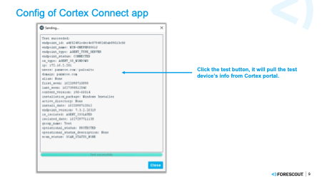

Forescout eyeExtend Connect Cortex XDR APP README.md  

**Contact Information**

Forescout Technologies, Inc. 190 West Tasman Drive San Jose, CA 95134 USA https://www.Forescout.com/support/ Toll-Free (US): 1.866.377.8771 Tel (Intl): 1.408.213.3191 Support: 1.708.237.6591

**About the Documentation**

Refer to the Technical Documentation page on the Forescout website for additional documentation: https://www.Forescout.com/company/technical-documentation/ Have feedback or questions? Write to us at documentation@forescout.com

**Legal Notice**

© 2020 Forescout Technologies, Inc. All rights reserved. Forescout Technologies, Inc. is a Delaware corporation. A list of our trademarks and patents can be found at https://www.Forescout.com/company/legal/intellectual-property-patents-trademarks. Other brands, products, or service names may be trademarks or service marks of their respective owners.

**APP Support**

•	All eyeExtend Connect Apps posted here are community contributed and community supported. These Apps are not supported by the Forescout Customer Support team.

•	See Contact Information above.

**About the eyeExtend Connect Cortex XDR APP**

•	WARNING: Please contact Cortex XDR support to get the API ID & key & URL before using this App.

**Version v1.0.0 Cortex XDR APP**

The APP queries the device’s properties from the Cortex XDR server.

**Version v1.0.1 Cortex XDR APP**

Added new properties and enabled Inventory on some attributes.

New properties:

 - Cortex XDR Endpoint Operating System
 - Cortex XDR Endpoint OS Version

Enabled Inventory on properties: 

 - Cortex XDR Endpoint Type
 - Cortex XDR Endpoint Status
 - Cortex XDR Endpoint OS Type
 - Cortex XDR Endpoint Domain
 - Cortex XDR Endpoint Content Version
 - Cortex XDR Endpoint Installation Package
 - Cortex XDR Endpoint Active Directory
 - Cortex XDR Endpoint Version
 - Cortex XDR Endpoint Isolation Status
 - Cortex XDR Endpoint Group Name
 - Cortex XDR Endpoint Operational Status
 - Cortex XDR Endpoint Operational Status Description
 - Cortex XDR Endpoint Scan Status
 - Cortex XDR Endpoint Operating System
 - Cortex XDR Endpoint OS Version

**Requirements**

•	Access to Cortex XDR server

•	Forescout CounterACT 8.3, 8.2, 8.1.4

•	Forescout eyeExtend Connect 1.5 or higher

•	Ensure that NTP setting of Forescout server is Synchronized. This is important as the Advanced API Key uses Time as part of connectivity to Cortex API server.

•	See license.txt file for license information

**User Interface**

You can refer to the Forescout eyeExtend Connect Module: Connect Application Building Guide, in particular the sections on ”Define system.conf File” and “User Interface Details”.

**Cortex Console Requirements**

•	Ensure that the API keys on Cortex are configured as “Advanced” and Generate with full Privileges like so.

•	Take note of the key. The outcome on the dashboard would be like this.

**Config of Cortex Connect app**

 
**Actions**

•	The Cortex Connect App allows the following actions

* Isolate endpoint – This informs the Cortex XDR server to isolate the endpoint
* Unisolate endpoint – This informs the Cortex XDR server to release the endpoint

•	Note that actions are binary and cannot be cancelled

* Apply another action to override the previous 
 

***The result of the action

•	The actions via the Cortex Connect app could be applied successfully.

**Policy Template**

•	There is a Template Policy to use for checking Heartbeat Status with Cortex XDR Cloud for endpoints

•	The Cortex XDR properties could be pulled successfully.

**Panels**

**Cortex XDR Connection**

Cortex XDR Authentication credentials.

Credentials are created via Cortex XDR portal.

**Property and Comment**

	Cortex XDR API ID	The API ID should be generated in the Cortex XDR portal.
	Cortex XDR API Key	The API Key should be generated in the Cortex XDR portal.
	Cortex XDR API URL	The URL of the Cortex server, e.g., 
	https://api-westconcoe.xdr.sg.paloaltonetworks.com
	Validate Certificate	Check to validate the HTTPS certificate (Don’t tick it by default)

**Cortex XDR Options**

**Focal appliance**

Each "API Domain Gateway" shall run on one dedicated focal appliance.

**Proxy Server**

Used to define proxy settings. (The proxy server setting is not working in this version)

**Test button**

•	Test is enabled by default.

•	Device info need to be saved (applied) before test can be successfully run.

**Example Test Result**
 

 
**Manage the APP**

**Import**

•	User can import the Cortex XDR Connect APP via eyeExtend Connect module

•	APP file shall look similar to **Cortex XDR 1.0.0.eca** which is signed

**Start and Stop APP**

•	User can start and stop the Cortex XDR App

•	When the APP is stopped, all properties resolve, actions and policy are suspended.

**Remove APP**

•	User can remove the APP if no longer needed

•	User need to delete the Cortex XDR policy first to remove the App.

**Policy Templates**

•	There is 1 default Cortex XDR Template

•	After importing the App. The policies can be found under Policy > Add > Cortex XDR >

* Cortex XDR Agent Reporting Status

**Actions**

•	Isolate Endpoint

•	Unisolate Endpoint

**Properties**

Properties gathered from the Cortex XDR.

* Cortex XDR Endpoint Active Directory
* Cortex XDR Endpoint Alias
* Cortex XDR Endpoint Content Version
* Cortex XDR Endpoint Domain
* Cortex XDR Endpoint ID
* Cortex XDR Endpoint Name
* Cortex XDR Endpoint Type
* Cortex XDR Endpoint Version
* Cortex XDR Endpoint First Seen
* Cortex XDR Endpoint Group Name
* Cortex XDR Endpoint Installation Package
* Cortex XDR Endpoint Install Date
* Cortex XDR Endpoint IP
* Cortex XDR Endpoint Isolation Status
* Cortex XDR Endpoint Isolation Date
* Cortex XDR Endpoint Last Seen
* Cortex XDR Endpoint Operational Status
* Cortex XDR Endpoint Operational Status Description
* Cortex XDR Endpoint OS Type
* Cortex XDR Endpoint Scan Status
* Cortex XDR Endpoint User
* Cortex XDR Endpoint Operating System
* Cortex XDR Endpoint OS Version

**Scripts**

•	Action scripts

**cortex_isolate.py**

**cortex_unisolate.py**

•	Resolve scripts

**cortex_resolve.py**

•	Test authentication to Cortex XDR 

**cortex_test.py**

**Inventory**

The following properties are available in the Inventory tab:

 - Cortex XDR Endpoint Type
 - Cortex XDR Endpoint Status
 - Cortex XDR Endpoint OS Type
 - Cortex XDR Endpoint Domain
 - Cortex XDR Endpoint Content Version
 - Cortex XDR Endpoint Installation Package
 - Cortex XDR Endpoint Active Directory
 - Cortex XDR Endpoint Version
 - Cortex XDR Endpoint Isolation Status
 - Cortex XDR Endpoint Group Name
 - Cortex XDR Endpoint Operational Status
 - Cortex XDR Endpoint Operational Status Description
 - Cortex XDR Endpoint Scan Status
 - Cortex XDR Endpoint Operating System
 - Cortex XDR Endpoint OS Version

**Notes**