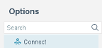
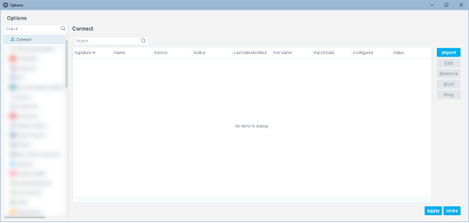
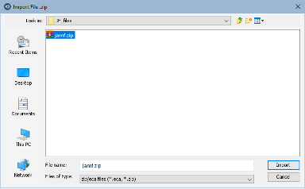
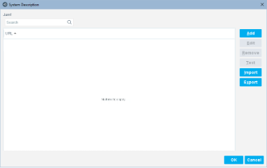
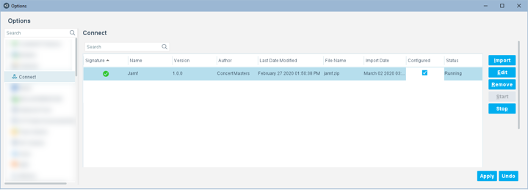
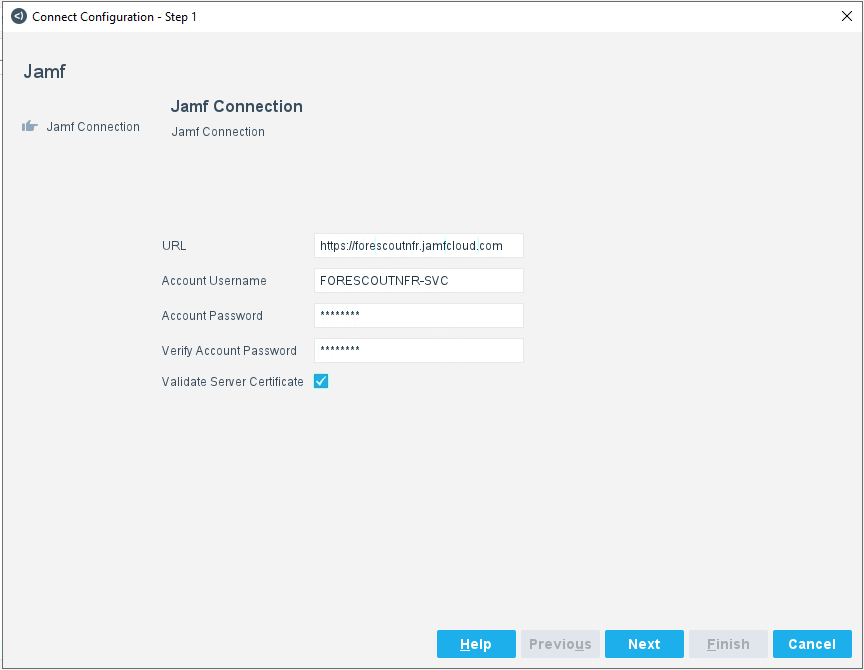
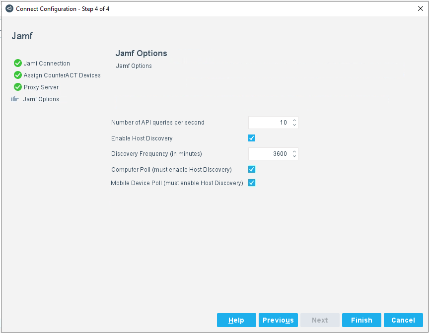
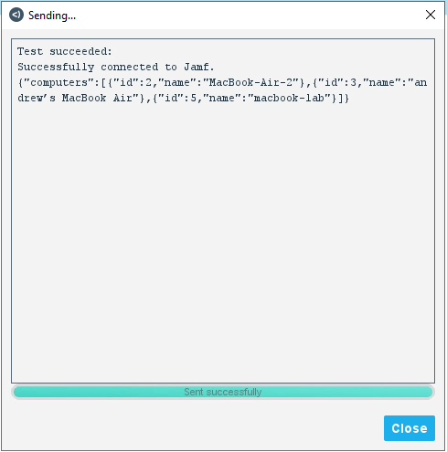
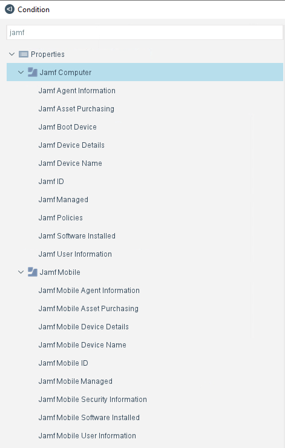

# Forescout eyeExtend Connect JAMF App

 
## Contact Information
Forescout Technologies, Inc.
190 West Tasman Drive
San Jose, CA 95134 USA
https://www.Forescout.com/support/
Toll-Free (US): 1.866.377.8771
Tel (Intl): 1.408.213.3191
Support: 1.708.237.6591

## About the Documentation
- Refer to the Technical Documentation page on the Forescout website for additional documentation:
https://www.Forescout.com/company/technical-documentation/
- Have feedback or questions? Write to us at documentation@forescout.com

## Legal Notice
© 2020 Forescout Technologies, Inc. All rights reserved. Forescout Technologies, Inc. is a Delaware corporation.
A list of our trademarks and patents can be found at https://www.Forescout.com/company/legal/intellectual-property-patents-trademarks.
Other brands, products, or service names may be trademarks or service marks of their respective owners.

## About the Jamf App
The Jamf app is an integration of the Forescout platform with Jamf Pro, which is an Apple/iOS MDM management platform. This app lets you pull data from Jamf about the MacOS endpoints managed by the Forescout platform. It also lets you assign specific endpoints to policies on the Jamf platform.

This app is for those Forescout platform users that have Jamf Pro in their environment and want to integrate it with the Forescout platform.

## Requirements

* Forescout version 8.2
* Jamf Pro

## User Interface Overview
After Connect is installed, Connect is displayed under Options. 

### Connect Pane Overview
Initially, the Connect pane is blank. The Jamf app has not been imported yet and the system description has not been configured yet.

### The buttons on the Connect pane are as follows:
Button  | Description
------------- | -------------
Import  | Import an App
Edit  | Edit an App
Remove  | Remove and App
Start  | Start an App
Stop  | Stop an App

The buttons are described in User Interface Details.

Select Import to import the app into Connect. Apps are in zip or eca format. They can be in any folder.

After an app is imported, the System Description dialog box opens. It is initially blank. See System Description Dialog Box Overview for configuration details.

After the system description for the app is configured, it is displayed in the Connect pane. There can be multiple apps displayed in this pane.

**Third-party vendor integrations are displayed inside the Connect pane, not on the left under Options.

If the configuration has not been saved, select Apply to enable the Start button, which starts an app and the Stop button, which stops an app.

You can select an existing app and then select Edit to open the System Description dialog box.

### System Description Dialog Box Overview

### Add a new Jamf server to the the App

The user configures the information for the connection to the Jamf server.  Remember, if the Server Certificate is to be verified, the Jamf system certificate will need to be in the Trusted Certificate Store on Forescout.

Next, choose the connecting appliance to communicate with Jamf and determine if a proxy is needed for the connection.

Finally, determine the Jamf options that will be used.

Option | Description
----------- | ----------
Number of API queries per second | Select a value for the rate limiter.  The rate limiter only applies to property resolves inside of the resolve scripts for a single host and won’t limit how often a policy might ask Jamf for properties on all hosts to check for a matching condition.
Enable Host Discovery | Check this box if you want to poll Jamf for all its managed devices.  If this box is checked, you must check at least one of the Computer or Mobile Device Poll boxes in order to discovery hosts managed by Jamf
Discovery Frequency | Select a value (in minutes) for how often Jamf will be polled for its managed devices.
Computer Poll | Check this box to poll Jamf for all of its Computers.  Any devices found will include a Jamf ID and that it is managed by Jamf.  Host Discovery must be enabled to poll for Computers.
Mobile Device Poll | Check this box to poll Jamf for all of its Mobile Devices.  Any devices found will include a Jamf ID and that it is managed by Jamf.  Host Discovery must be enabled to poll for Mobile Devices.

And Finish adding the Jamf server.

### Test a Jamf Connection

After saving and applying the new Jamf server connection, you can test that it is working and authenticating correctly.  This test will return Computers in the Jamf server (not Mobile Devices).

## Properties
Jamf properties are available to be used in a policy.
	**To access the Jamf properties:**
	
1. When configuring a policy, select **Add** in the Condition section of the Main Rule or Sub-Rule dialog box.
	
2. Expand the Jamf folders and select a property. 

Jamf properties are divided into 2 groups, one for managed Computers and one for managed Mobile Devices.  

**The following Computer properties are available:**

Property Name | Description
-------- | --------
Jamf Agent Information | The following sub-properties are available: Agent Version, Initial Entry, Last Contacted
Jamf Asset Purchasing | The following sub-properties are available: Leased, Purchased
Jamf Boot Device | The following sub-properties are available: FileVault Status, Name, Size, FileVault Percent, Percentage Full
Jamf Device Details | The following sub-properties are available: Memory (Total), Operating System, Serial Number, Make, Battery Capacity, Processor Speed, Model, Operating System Version, Processor Type, Operating System Build, Processor Cores (Total), Processor Architecture, Processors (Total)
Jamf Device Name | The name of the device in Jamf
Jamf ID | The Jamf ID, which can be entered as a single number, a list of numbers, or a range of numbers
Jamf Managed | The device is or is not managed by Jamf
Jamf Policies | The policies applied to the device in Jamf
Jamf Software Installed | Full list of the software installed on the device
Jamf User Information | The following sub-properties are available: Real Name, Email Address, Username, Phone number, Position

**The following Mobile Device properties are available:**

Property Name | Description
-------- | --------
Jamf Mobile Agent Information | The following sub-properties are available: Agent Version, Initial Entry, Last Contacted
Jamf Mobile Asset Purchasing | The following sub-properties are available: Leased, Purchased
Jamf Mobile Device Details | The following sub-properties are available: Capacity, OS Type, Serial Number, Phone Number, UDID, Model, OS Version, Model Number, OS Build, Model Identifier
Jamf Mobile Device Name | The name of the device in Jamf
Jamf Mobile ID | The Jamf ID, which can be entered as a single number, a list of numbers, or a range of numbers
Jamf Mobile Managed | The device is or is not managed by Jamf
Jamf Mobile Security Information | The following sub-properties are available: Data Protection Enabled, Passcode Present, Passcode Compliant, Hardware Encryption, Activation Lock Enabled, Lost Mode Enabled, Lost Mode Enforced, Lost Mode Enabled Issued Date, Jailbreak Detected
Jamf Mobile Software Installed | Full list of the software installed on the device
Jamf Mobile User Information | The following sub-properties are available: Real Name, Email Address, Username, Phone number, Position

## Actions
Jamf actions are available to be used in a policy.  **This action is specific to Computers.**

A computer can be assigned to a Jamf policy.

## Licenses
This App bundles with a license.txt file. Please review the license.txt file.
