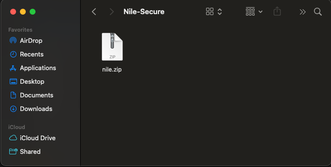
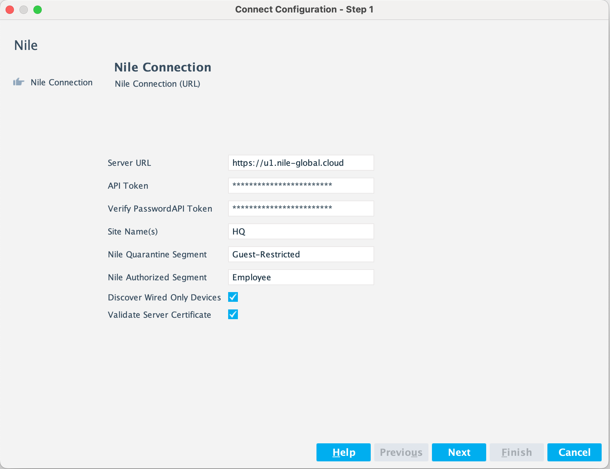
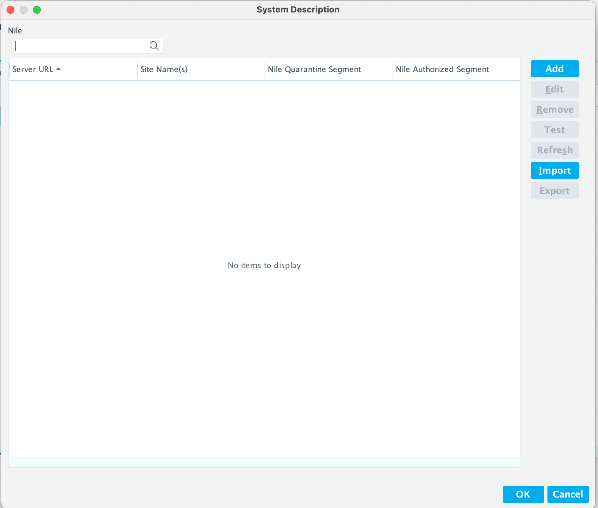
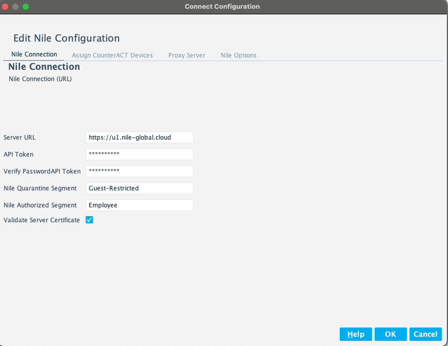
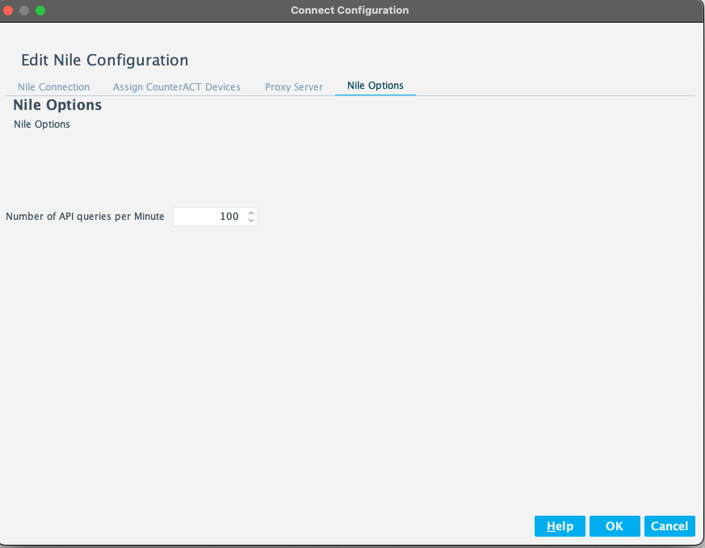
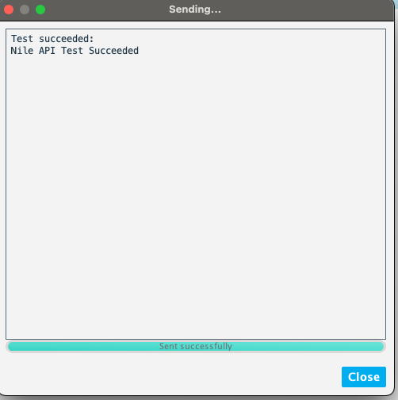

# Forescout eyeExtend Connect Nile App
 
## Contact Information
Forescout Technologies, Inc.
190 West Tasman Drive
San Jose, CA 95134 USA
https://www.Forescout.com/support/
Toll-Free (US): 1.866.377.8771
Tel (Intl): 1.408.213.3191
Support: 1.708.237.6591

## About the Documentation
- Refer to the Technical Documentation page on the Forescout website for additional documentation:
https://www.Forescout.com/company/technical-documentation/
- Have feedback or questions? Write to us at documentation@forescout.com

## Legal Notice
© 2020 Forescout Technologies, Inc. All rights reserved. Forescout Technologies, Inc. is a Delaware corporation.
A list of our trademarks and patents can be found at https://www.Forescout.com/company/legal/intellectual-property-patents-trademarks.
Other brands, products, or service names may be trademarks or service marks of their respective owners.

## About the Nile App
The Nile Connect App seamlessly integrates Forescout eyeSight and Nile, enabling precise policy enforcement on Endpoints connecting to the Service provided by Nile.

This app is for those Forescout platform users that have Services and Solutions from Nile in their environment and want to integrate it with the Forescout platform.

## Requirements
* Forescout version 8.4
* Customers using Nile Service

## User Interface Overview
After Connect is installed, Connect is displayed under Options. 

### Connect Pane Overview
Initially, the Connect pane is blank. The Nile app has not been imported yet and the system description has not been configured yet.

### The buttons on the Connect pane are as follows:
|--------------------------|
| Button | Description     |
|--------+-----------------|
| Import | Import an App   |
| Edit   | Edit an App     |
| Remove | Remove and App  |
| Start  | Start an App    |
| Stop   | Stop an App     |
|--------------------------|
The buttons are described in User Interface Details.

Select Import to import the app into Connect. Apps are in zip or eca format. They can be in any folder.

After an app is imported, the System Description dialog box opens. It is initially blank. See System Description Dialog Box Overview for configuration details.

After the system description for the app is configured, it is displayed in the Connect pane. There can be multiple apps displayed in this pane.

**Third-party vendor integrations are displayed inside the Connect pane, not on the left under Options.

If the configuration has not been saved, select Apply to enable the Start button, which starts an app and the Stop button, which stops an app.

You can select an existing app and then select Edit to open the System Description dialog box.

### System Description Dialog Box Overview

### Add Nile Configuration to the the App

The user configures the information for the connection to Nile Portal.  Remember, if the Server Certificate is to be verified, the Nile Root CA certificate will need to be in the Trusted Certificate Store on Forescout.

Next, choose the connecting appliance to communicate with Nile Portal and determine if a proxy is needed for the connection.

Finally, determine the Nile options that will be used.

Option                           | Description
-------------------------------- | ------------------------------------
Number of API queries per Minute | Select a value for the rate limiter.  

And Finish adding the Nile Connect App Configuration.

### Test a Nile Connect App Connection

After saving and applying the new Nile Connect App configuration, you can test that it is working and authenticating correctly.  This test will return result of the test.

## Properties
Nile Connect App has no properties available to be used in a Policy (see Actions).

## Actions
Nile Connect App actions are available to be used in a policy.  
**This action is specific to Endpoints.**

An endpoint can be assigned to a Nile Connect App Policy.

## Licenses
This App bundles with a license.txt file. Please review the license.txt file.
