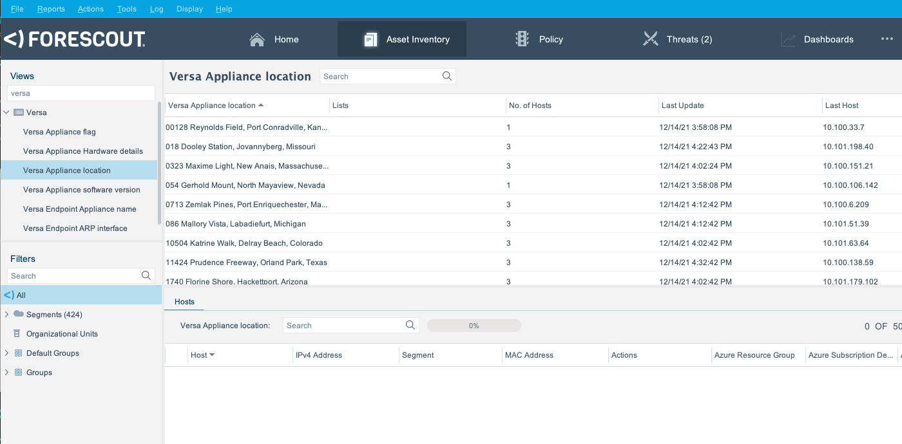
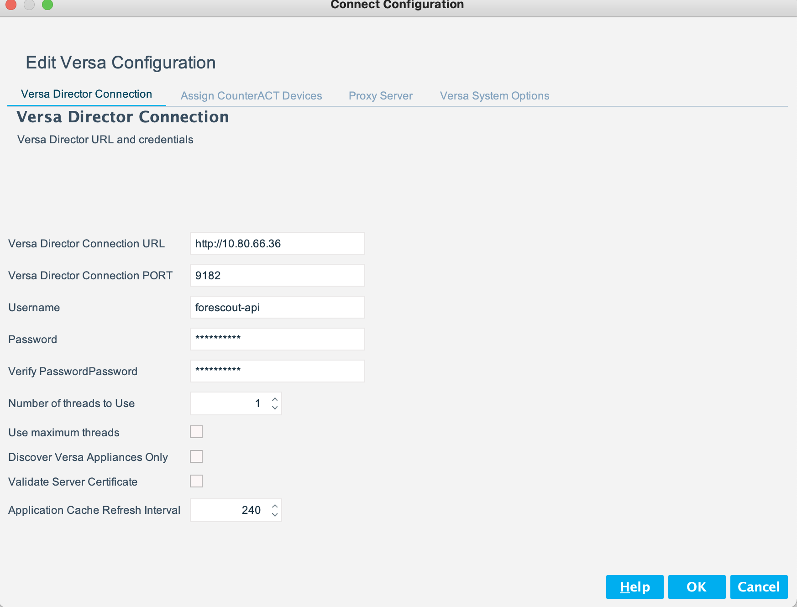
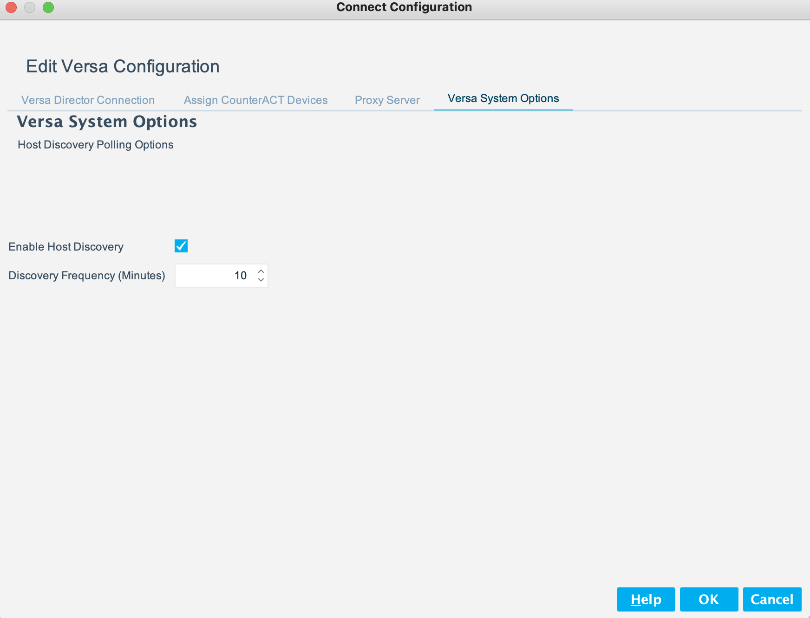
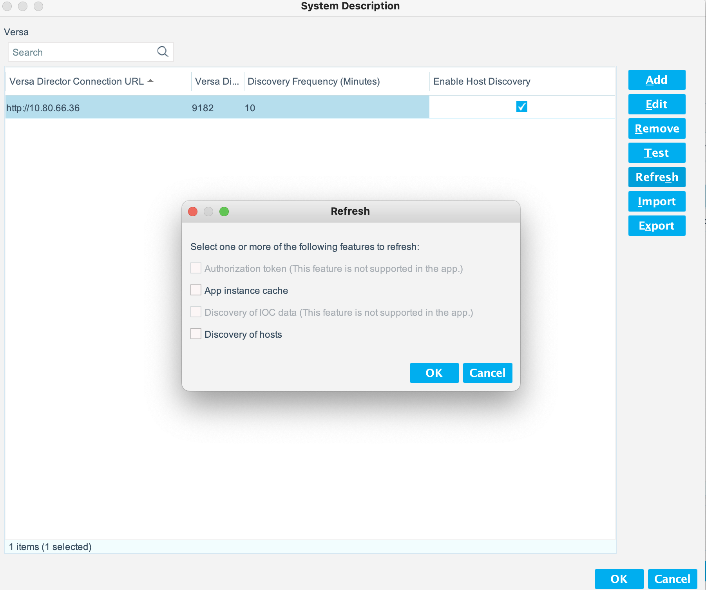

# Forescout  
Forescout eyeExtend for Versa SD-WAN App README.md


### Contact Information  

All eyeExtend Connect Apps posted here are community contributed and community supported. These Apps are not supported by the Forescout Customer Support team.

For questions of feedback, please send us an email below:

        **[connect-app-help@forescout.com](mailto:connect-app-help@forescout.com)**

### Forescout Documentation Portal

To access Forescout documentation, please refer to [https://docs.forescout.com/](https://docs.forescout.com/)

### Legal Notice

© 2020 Forescout Technologies, Inc. All rights reserved. Forescout Technologies, Inc. is a Delaware corporation.
A list of our trademarks and patents can be found at https://www.Forescout.com/company/legal/intellectual-property-patents-trademarks.
Other brands, products, or service names may be trademarks or service marks of their respective owners.


### Licenses
This App includes a license file. Please review the `license.txt` file included in the distribution.

## About Connect APP for Versa SD-WAN

The Connect App for [Versa SD-WAN](https://versa-networks.com/products/sd-wan.php) provides an interface for the eyeSight Platform to communicate with the SD-WAN infrastructure.  

## App Version 1.0.0

The App performs polling of the SD-WAN Director to discovery Appliances and IP endpoints active in the network.  Appliance details such as hardware capabilities, software versions, and Location are reflected in the eyeSight Inventory tab.



Additionally, eyeSIght policies can be created to leverage any of the supplied properties below:

### Properties

Property                      | Type       | Description
----------------------------- | ---------- | -----------------------
`connect_versa_appliance`     | Boolean    | True if endpoint is an appliance
`connect_versa_appliance_name`| String     | Name of the Appliance
`connect_versa_vrf_name`| String     | Versa Endpoint VRF name
`connect_versa_arp_interface`| String     | Versa Endpoint ARP interface
`connect_versa_appliance_location`| String     | Versa Appliance location
`connect_versa_appliance_uuid`| String     | Versa Appliance UUID
`connect_versa_appliance_syncstatus`| String     | Versa Appliance sync status
`connect_versa_appliance_softwareversion`| String     | Versa Appliance software version
`connect_versa_appliance_hardware`| Composite     | Provides multiple subfields with hardware details


### Scripts

Script        | Function
------------- | -----------------------------
versa_test.py | Test Script, will return the Versa Organization
versa_poll.py | Poll Script, gathers Appliances and Endpoints
versa_cache.py| Application Cache Script
versa_func.py | Library Script, Versa functions

### Platform Requirements

The following software versions were tested:

Versa:

* 16.1R2
* 21.1

eyeExtend Connect Plugin 1.6


## Configuring the Connect APP for Versa SD-WAN

There are two system panels provided with the App that must be configured.

### Versa Director Connection Panel



Below are descriptions for each field:

Field                            | Description
-------------------------------- | ------------------------------------------
Versa Director Connection URL    | The URL of the Versa Director without port
Versa Director Connection PORT   | The port number that the Versa Director is using
Username                         | Versa Director Username
Password                         | Versa Director Password
Number of threads to Use         | Increase for large networks
Use maximum threads              | Set to max threads for very large networks to decrease poll time required
Discover Versa Appliances Only   | Will not discover endpoints from the ARP table, appliances only
Validate Server Certificate      | If check, eyeSight will validate the Cert
Application Cache Refresh Interval | How often to refresh App Cache


### Versa System Options Panel



Below are descriptions for each field:

Field                            | Description
-------------------------------- | ------------------------------------------
Enable Host Discovery            | Must be checked for polling
Discovery Frequency (Minutes)    | How often to poll Versa for endpoints


## Performance Considerations

The Connect APP for Versa SD-WAN is taking advantage of asynchronous execution using threads to decrease the time required to poll a large network.  

**Recommendations for large networks:**

* Check `Use maximum threads` on the `System Options Panel` to make maximum use of the threading capabilities.  

* If `Discover Versa Appliances Only` is unchecked all SD-WAN nodes will be queried for ARP each polling cycle which can take a long time in larger networks.  In order to accommodate this longer polling time the connect module will need to have the read timeout set to greater than the default polling timeout of 2 minutes. This can be done using the following fstool command:

``` 
fstool connect_module set_property connect.python.socket.read.timeout.seconds <number of seconds>

```
    
As a point of reference, one customer tested a network with over 1000 nodes in the SD-WAN environment. Without threading, a full polling cycle was taking well over 2 hours, with threading enabled it was taking approximately 13 minutes.


## Future Enhancements

If you have suggestions for future enhancements or would like to contribute, please let us know on the [Forescout Community Slack](https://forescout.slack.com/).

Some ideas below for the next release.

* App Proxy Support
* Multi-tenant environment support
* eyeSight Actions:
	* Add/Remove Endpoint from SD-WAN Service Template
	* Commit SD-WAN Service Templates
	* Add/Remove Endpoint from SD-WAN Address Group
* eyeSight Policy Templates for common functions


## Known Issues

* This app has not been tested in a multi-tenant environment.
* If you trigger a manual Discovery of hosts via the Connect module refresh options against a large SD-WAN environment the GUI may show a timeout error.  The discovery is still running and will update hosts when complete.

### Refreshing Discovery of Hosts




